# PRD — Project Requirements Document

**Versi:** 1.0 (draf awal) · **Tanggal:** 7 Oktober 2026

## 1. Overview

**Nama Produk:** AI MEDIA BUYER — ADS Automation 
**Jenis:** Sistem automation iklan Meta dari hulu ke hilir — dashboard web (kontrol, approval, penelusuran) + bot Telegram (notifikasi, approval cepat, tanya jawab) + mesin workflow (n8n) + agen AI (kombinasi **Jev** dan **Claude**)
**Cakupan:** Enam tahap berurutan: (1) riset pasar dan pemilihan produk, (2) riset audiens, (3) landing page HTML, (4) konten iklan (gambar, video, copywriting), (5) peluncuran lewat MCP Meta dan A/B testing, (6) loop utama (monitoring, analisa, scale, dan keputusan creative baru)
**Pengguna:** Pemilik bisnis yang baru mulai beriklan sebagai operator utama, dengan kemungkinan satu sampai tiga staf terpercaya (dibatasi daftar putih Telegram)
**Bahasa Antarmuka:** Bahasa Indonesia, mata uang Rupiah, zona waktu Asia/Jakarta (WIB)
**Gaya Visual:** Dashboard bersih, antrean approval dan tombol hentikan semua aksi sebagai elemen paling menonjol, kartu angka besar, grafik sederhana, nyaman dibuka di ponsel. Prototipe antarmuka awal sudah dibuat sebagai acuan tata letak.

### Keputusan yang Berlaku di PRD Ini
1. **Enam tahap, satu alur.** Tahap 1 sampai 4 menghasilkan artefak (market brief, profil audiens, file landing page, paket creative). Tahap 5 dan 6 mengoperasikan iklan. Tahap 6 adalah loop yang berulang dan dapat kembali ke tahap 4 (serta tahap 3 bila pesan landing page perlu disesuaikan) melalui keputusan creative baru.
2. **Tidak ada aksi ke akun iklan tanpa persetujuan.** Semua kampanye dibuat berstatus **PAUSED**. Mode bawaan adalah **Saran + approve**. Mode **Otomatis dengan batas** hanya dapat diaktifkan pemilik setelah aturan terbukti dan tetap tunduk pada batas keras.
3. **Kill switch global.** Tombol "Hentikan semua aksi" (di dashboard dan perintah `/stop` di bot) menghentikan seluruh aksi tulis otomatis. Setiap workflow wajib memeriksa statusnya sebelum bertindak.
4. **Pembagian kerja model.** Kode menghitung angka (CPA, ROAS, tren). **Jev** memberi penilaian terstruktur dan cepat (label, skor, ya/tidak dengan tingkat keyakinan) dalam volume besar. **Claude** menalar dan menulis (analisa, hipotesis, brief, copy, HTML). Keputusan yang menyentuh uang diambil oleh aturan kode dengan batas keras; skor Jev dan analisa Claude hanyalah masukan.
5. **Jev dibungkus satu fungsi `judge()`.** Ambang keyakinan ditetapkan pemilik; penilaian di bawah ambang diteruskan ke Claude atau manusia. Fungsi ini dapat dialihkan ke model umum lewat konfigurasi bila akses atau perilaku Jev berubah. Ketersediaan akses Jev diperiksa saat implementasi.
6. **Database PostgreSQL adalah satu-satunya sumber data** bagi n8n, dashboard, dan bot. AI tidak menyimpan keadaan dan tidak menulis langsung ke data final.
7. **Koneksi ke Meta lewat MCP Meta.** Memakai server MCP Meta (resmi bila tersedia untuk akun; server komunitas sebagai alternatif) atau Marketing API langsung sebagai cadangan, dengan izin `ads_read` dan `ads_management`. Status dan cakupan fitur diverifikasi pada dokumentasi Meta saat implementasi.
8. **Riset kompetitor dari Meta Ad Library tanpa scraping sendiri.** API resmi Ad Library tidak mengembalikan iklan komersial untuk Indonesia, sehingga jalur bawaan adalah **semi-manual** (pengguna memasukkan URL, teks, atau tangkapan iklan). Layanan data pihak ketiga bersifat opsional dan hanya dipakai setelah pemilik menyetujui risikonya. Karena hanya iklan aktif yang terlihat, sistem menyimpan snapshot berkala.
9. **Aset produk fisik memakai foto atau video asli.** Visual hasil AI tidak boleh memperlihatkan hasil, kondisi, atau klaim yang tidak nyata.
10. **Landing page berupa satu file HTML mandiri** yang diunduh pengguna lalu dipasang di hosting sendiri. Penerapan otomatis ke hosting berada di luar cakupan versi ini.
11. **Setiap angle dilacak dari ide sampai hasil** lewat `angle_id` yang melekat pada creative, landing page, iklan, dan eksperimen.
12. **Setiap eksperimen wajib punya kriteria menang tertulis sebelum diaktifkan** (variabel, hipotesis, ukuran data minimum, metrik penentu).
13. **Kunci rahasia (token Meta, API key AI, kredensial database, token bot)** hanya ada di variabel lingkungan server, tidak pernah dikirim ke browser atau ditulis ke log.
14. **Akses dibatasi daftar putih.** Hanya akun Telegram yang terdaftar yang dilayani bot; akses dashboard memakai tautan masuk sekali pakai dari bot.
15. **Koneksi ke agen AI memakai base URL.** Backend memanggil Claude lewat `AI_BASE_URL` dan `AI_API_KEY`; model utama dan model ringan diatur lewat variabel lingkungan sehingga penyedia atau model dapat diganti tanpa mengubah kode.
16. **Database dan penyimpanan file memakai Neon.** Data relasional ada di **PostgreSQL di Neon**; berkas (aset creative, file landing page, snapshot, ekspor) ada di **Neon Object Storage** yang kompatibel S3 dan diakses lewat SDK S3 standar. Basis data hanya menyimpan kunci objek dan metadata. Lapisan penyimpanan dibuat tipis agar dapat dialihkan ke penyimpanan S3 lain (mis. Cloudflare R2 atau AWS S3) lewat konfigurasi.
17. **Preview dengan komentar langsung ke agent.** Landing page HTML dan creative punya halaman preview. Pengguna menandai bagian yang kurang sesuai dan menulis komentar; agent merevisi hanya bagian terkait dan menghasilkan **versi baru** yang dapat dibandingkan, dikembalikan, atau disetujui. Komentar bukan perubahan langsung ke data final; hasil revisi tetap melewati pra-cek dan approval.
18. **Skill agent dikelola di dashboard, dijalankan lewat n8n.** Isi skill (instruksi, contoh, panduan brand, skema keluaran) disimpan di database dan diedit di dashboard dengan versi dan uji. n8n hanya mengatur alur (kapan dan urutan) dan mengambil skill aktif lewat API saat berjalan. Skill tidak dapat mengubah batas keras, kill switch, atau aturan scale.
19. **Dua jalur masuk produk.** Produk dapat dimulai dari **riset pasar** (tahap 1) atau dari **brief produk manual** yang diisi pemilik. Keduanya bermuara ke **Insight Produk** (kekuatan dan pain point) yang menjadi sumber bersama untuk profil audiens, landing page, dan creative.
20. **Insight berlabel dasar, bukan klaim otomatis.** Setiap insight ditandai asalnya (`from_brief`, `from_research`, `ai_inference`, `user_added`). Hanya insight yang bersumber dari brief atau sudah dikonfirmasi pengguna yang boleh dipakai sebagai klaim faktual di landing page dan iklan. AI tidak boleh mengarang fakta seperti harga, sertifikasi, angka penjualan, atau testimoni; bila bukti belum ada, insight ditandai butuh bukti.

### Latar Belakang
Pengiklan baru menghadapi rantai pekerjaan yang panjang dan saling bergantung: memilih produk, memahami audiens, membuat landing page, memproduksi creative, menjalankan iklan, lalu menjaga performanya. Tanpa sistem, yang umum terjadi:
- **Produk dipilih berdasarkan firasat**, bukan data permintaan, persaingan, dan margin.
- **Landing page dan creative tidak selaras** dengan audiens, sehingga klik ada tetapi pembelian tidak.
- **Iklan diuji tanpa disiplin**: banyak variabel diubah sekaligus, pemenang diputuskan dari data yang terlalu sedikit.
- **Budget dinaikkan terlalu cepat atau terlambat**, dan creative yang jenuh baru disadari setelah biaya per hasil melonjak.
- **Waktu habis** untuk berpindah antar alat: riset, desain, penulisan copy, Ads Manager, dan lembar kerja.

Ads Loop menyatukan keenam tahap menjadi satu alur: riset dan artefak dihasilkan dengan bantuan AI, kampanye dijalankan lewat MCP Meta dengan persetujuan manusia, lalu loop harian memantau, menganalisa, memutuskan, dan memperbarui creative.

### Tujuan Utama
1. **Memilih produk dengan data:** kandidat produk diberi skor dan alasan, dengan market brief yang menjadi bahan landing page dan iklan.
2. **Menghasilkan aset siap pakai:** profil audiens, file landing page HTML, dan paket creative (gambar, video, copy) per angle.
3. **Menjalankan iklan dengan aman:** kampanye dibuat PAUSED, diluncurkan setelah approval, diuji dengan disiplin A/B testing.
4. **Menjaga performa lewat loop:** monitoring, analisa, scale, pause, dan keputusan creative baru dengan batas keras dan kill switch.
5. **Belajar dari pasar:** riset kompetitor dan hasil iklan sendiri menjadi masukan untuk angle berikutnya.
6. **Menjaga keamanan dan biaya:** akses terbatas, tidak ada aksi tanpa persetujuan, pemakaian AI dibatasi.

### Target Pengguna
| Segmen | Kebutuhan Utama |
|---|---|
| Pemilik/operator | Memilih produk, menyetujui aset dan aksi, memantau performa, mengatur batas dan aturan, menghentikan semua aksi bila perlu |
| Staf/reviewer (opsional) | Meninjau creative dan landing page, menjalankan riset, mengunggah aset asli |
| Bot Telegram | Mengirim notifikasi dan alert, menerima approval cepat, menjawab pertanyaan, menerima aset |
| Mesin workflow dan agen AI | Menarik data, menilai (Jev), menalar dan menulis (Claude), menjalankan aksi yang sudah disetujui |

### Metrik Sukses
- **Riset pasar:** market brief untuk satu produk selesai dalam < 15 menit dengan minimal tiga kandidat produk berskor.
- **Landing page:** file HTML valid dihasilkan dalam < 2 menit; skor performa mobile ≥ 80 pada pemeriksaan standar.
- **Paket creative:** minimal tiga angle dengan tiga varian copy dan visual per paket; 100% melalui approval sebelum dipakai.
- **Keamanan peluncuran:** 100% kampanye dibuat berstatus PAUSED; 0 aksi tulis ke akun iklan saat kill switch aktif.
- **Disiplin eksperimen:** 100% eksperimen memiliki kriteria menang tertulis sebelum aktif.
- **Kesegaran data:** data iklan diperbarui paling lambat 3 jam sekali; alert terkirim dalam 30 menit setelah sinkronisasi yang melewati ambang.
- **Kualitas penilaian Jev:** ≥ 90% label sesuai penilaian manusia pada sampel uji; 100% penilaian di bawah ambang keyakinan diteruskan, bukan dipakai langsung.
- **Disiplin scale:** 0 kenaikan budget yang melewati batas persentase, batas jeda, atau batas harian.
- **Keamanan akses:** 0 permintaan dari akun di luar daftar putih yang diproses.
- **Kendali biaya AI:** pemakaian tidak melewati batas harian dan bulanan yang ditetapkan pemilik.

*(Seluruh angka target adalah usulan awal dan dapat diubah.)*

---

## 2. Requirements

### Kebutuhan Fungsional per Halaman
| Halaman | Isi Wajib |
|---|---|
| `/login` | Masuk lewat tautan sekali pakai yang dikirim bot (`/login`); tidak ada kata sandi |
| `/` (Ringkasan) | Kartu spend, hasil, CPA, ROAS; hasil 7 hari; alert aktif; jumlah item menunggu approval; status loop dan kill switch |
| `/produk/baru` | Formulir brief produk manual (mode cepat dan lengkap): nama dan deskripsi, harga dan varian, spesifikasi, kelebihan menurut pemilik, target pembeli, masalah yang diselesaikan, pembeda, bukti (testimoni, sertifikasi, foto), batasan klaim, penawaran dan garansi, cara order, nada bahasa; dapat ditempel dari teks atau diunggah dari berkas |
| `/produk/[id]` | Brief produk dan **Insight Produk**: daftar kekuatan dan pain point hasil AI dengan label dasar, status bukti, risiko klaim, dan pemetaan pain point ke kekuatan; edit, tambah, kunci, tolak, jawab pertanyaan klarifikasi, lalu konfirmasi; tombol lanjut ke audiens dan landing page |
| `/riset` | Daftar kandidat produk dengan skor (permintaan, persaingan, margin, kemudahan iklan, kecocokan), alasan, dan keyakinan; tombol pilih produk |
| `/riset/[id]` | Market brief satu produk: permintaan, harga pasar, kompetitor, celah, risiko, rencana validasi; sumber data dan tanggal |
| `/audiens` | Persona, masalah, keberatan, bahasa audiens, daftar hook awal, usulan targeting awal |
| `/kompetitor` | Daftar kompetitor, snapshot iklan, label angle/hook/penawaran, metrik proxy (lama tayang, jumlah variasi), peta celah pasar |
| `/landing-page` | Daftar landing page dan versinya, pratinjau, unduh HTML, catatan pemasangan, hasil pra-cek |
| `/landing-page/[id]` | Detail halaman: angle, blok, aset, penanda Pixel/UTM, riwayat versi; **preview interaktif** (mobile/desktop), **mode komentar** (klik bagian halaman untuk memberi komentar), panel komentar dengan status, tombol kirim ke agent, perbandingan antar versi, kembalikan versi, setujui |
| `/creative` | Pustaka creative dengan filter angle dan status; pembuat paket creative; hasil pra-cek kebijakan |
| `/creative/[id]` | Detail creative: copy, visual, video, angle, performa, status (draf, disetujui, dipakai, jenuh, pensiun); **preview** sebagai tampilan iklan (feed, story/reels, carousel) dengan batas teks sesuai tampilan nyata; **komentar** pada teks (rentang karakter), gambar (titik/area), dan video (timestamp/adegan); perbandingan versi dan persetujuan |
| `/kampanye` | Kampanye, ad set, dan iklan beserta status di Meta dan status internal; pemeriksaan pra-peluncuran |
| `/eksperimen` | Daftar A/B test: variabel, varian, progres data, kriteria menang, status, hasil |
| `/approval` | Antrean semua item menunggu keputusan dengan alasan dan pratinjau; setujui, tolak, minta revisi |
| `/laporan` | Laporan harian dan mingguan (angka dari kode, ulasan dari Claude); performa per angle dan per creative; ekspor Excel dan PDF |
| `/aturan` | Batas budget, aturan scale dan pause, pemicu creative baru, ambang keyakinan Jev, mode (saran + approve atau otomatis), kill switch |
| `/skill` | Daftar skill agent (riset pasar, analisa produk, audiens, landing page, copywriting, arahan visual dan video, analisa, kompetitor, revisi dari komentar) dengan status, versi aktif, dan tahap yang memakainya |
| `/skill/[id]` | Editor skill: instruksi, contoh, panduan brand, skema keluaran, tingkat model; riwayat versi, uji pada contoh masukan, bandingkan keluaran versi lama dan baru, aktifkan atau kembalikan versi |
| `/pengaturan` | Koneksi Meta (status dan izin), koneksi AI (base URL dan model tampil, key tersamar, tombol uji koneksi), status Jev, pengguna, batas AI, target CPA, produk aktif |
| `/log` | Log audit perubahan data dan semua aksi ke Meta, dapat disaring per pengguna, jenis, dan tanggal |

### Kebutuhan Non-Fungsional
- **Keamanan akses:** bot hanya melayani ID pengguna Telegram yang terdaftar dan aktif; webhook diverifikasi dengan secret token; akses dashboard memakai tautan sekali pakai (kedaluwarsa singkat) dan sesi cookie `httpOnly`.
- **Persetujuan wajib:** aset yang dihasilkan AI dan semua aksi tulis ke akun iklan (membuat, mengaktifkan, mengubah budget, menjeda) harus melalui item approval; tidak ada penulisan final tanpa aksi pengguna, kecuali dalam mode otomatis dengan batas yang sudah disetujui pemilik.
- **Kill switch:** status dicek oleh setiap workflow sebelum aksi tulis; saat aktif, persetujuan terkunci dan semua pekerjaan terjadwal hanya membaca.
- **Batas keras:** budget harian maksimum, kenaikan maksimum per langkah, jeda minimum antar scale, dan total spend harian maksimum diperiksa di lapisan kode sebelum aksi dikirim ke Meta; model AI tidak dapat melewatinya.
- **Idempotensi:** setiap aksi ke Meta memakai kunci idempotensi; aksi yang sama tidak dijalankan dua kali; `update_id` Telegram diproses sekali; aksi yang gagal dicatat dan tidak diulang diam-diam.
- **Asinkron:** webhook membalas cepat; pekerjaan berat (riset, pembuatan HTML, pembuatan visual, sinkronisasi data) berjalan di latar belakang dengan status yang jelas; kegagalan selalu tercatat dan dilaporkan.
- **Validasi keluaran AI:** keluaran Jev dan Claude divalidasi dengan skema sebelum dipakai; keluaran tidak valid ditolak dan dicatat.
- **Audit:** setiap pembuatan, perubahan, persetujuan, penolakan, dan aksi ke Meta tercatat di `audit_log` dan `action_log`; penghapusan bersifat *soft delete*.
- **Batas laju Meta:** pemanggilan dikelompokkan, dijeda, dan diulang dengan *backoff*; token dipantau kedaluwarsanya dan alert dikirim sebelum habis.
- **Integritas data tracking:** sebelum peluncuran dan secara berkala, sistem memeriksa Pixel/CAPI dan event konversi; bila tracking bermasalah, aturan scale dikunci.
- **Kepatuhan kebijakan iklan:** copy, visual, dan landing page melewati pra-cek klaim berisiko (kesehatan, keuangan, sebelum-sesudah, janji hasil); hasilnya adalah peringatan, bukan jaminan lolos tinjauan Meta.
- **Kendali biaya AI:** batas panggilan harian dan anggaran bulanan; pemakaian token dan biaya pembuatan gambar/video dicatat per tujuan; model ringan untuk tugas sederhana.
- **Privasi:** data yang dikirim ke penyedia AI diminimalkan (tanpa data pribadi pelanggan); aset dan data kompetitor hanya data publik.
- **Perangkat:** dashboard mengutamakan ponsel dan desktop; Telegram tetap jalur notifikasi dan approval cepat.
- **Bahasa dan format:** seluruh antarmuka dan balasan bot dalam Bahasa Indonesia; format tanggal Indonesia; Rupiah dengan pemisah ribuan.
- **Cadangan data:** ekspor data mingguan otomatis ke penyimpanan, ditambah tombol ekspor manual.

- **Preview aman:** halaman HTML hasil agent ditampilkan dalam `iframe` ber-*sandbox* (tanpa akses ke sesi atau cookie dashboard); skrip penanda komentar hanya disisipkan pada preview dan tidak ada di file yang diunduh; keluaran agent disaring (tanpa skrip dari sumber luar yang tidak diizinkan).
- **Komentar terlacak:** setiap komentar menyimpan versi dan posisi (blok, rentang teks, area gambar, atau timestamp video) serta potongan teks saat itu, sehingga tetap bermakna setelah halaman berubah.
- **Revisi terkendali:** revisi hanya mengubah bagian yang dikomentari dan menjaga konsistensi seperlunya; setiap revisi membuat versi baru, tidak menimpa versi lama; ada batas jumlah revisi per jam dan per hari serta batas biaya pembuatan gambar dan video.
- **Skill terversi:** setiap keluaran agent mencatat versi skill yang dipakai; hanya pemilik yang dapat mengaktifkan versi skill; perubahan skill tidak berlaku surut pada keluaran lama.
- **Kejujuran insight:** setiap insight menyimpan dasar (`from_brief`, `from_research`, `ai_inference`, `user_added`), status bukti, dan risiko klaim. Landing page dan iklan hanya memakai insight terkonfirmasi sebagai klaim faktual; angka, sertifikasi, dan testimoni tidak dibuat oleh AI. Brief yang kurang memicu pertanyaan klarifikasi (maksimal lima sekaligus), bukan pengisian dengan karangan.
### User Stories
- **Sebagai pemilik**, saya ingin sistem membandingkan beberapa kandidat produk dengan skor dan alasan, agar saya memilih produk berdasarkan data.
- **Sebagai pemilik**, saya ingin market brief satu produk yang bisa langsung dipakai untuk landing page dan iklan, agar saya tidak riset ulang.
- **Sebagai pemilik**, saya ingin profil audiens dan daftar hook awal setelah produk dipilih, agar iklan pertama punya arah yang jelas.
- **Sebagai pemilik**, saya ingin file landing page HTML yang tinggal diunduh dan dipasang, agar saya tidak perlu desainer atau pengembang.
- **Sebagai pemilik**, saya ingin paket creative (gambar, video, copy) per angle, agar saya dapat menguji beberapa pendekatan sekaligus.
- **Sebagai pemilik**, saya ingin melihat pra-cek klaim berisiko sebelum iklan atau halaman dipakai, agar risiko ditolak Meta berkurang.
- **Sebagai pemilik**, saya ingin kampanye dibuat berstatus PAUSED dan baru aktif setelah saya setujui, agar tidak ada uang terpakai tanpa sepengetahuan saya.
- **Sebagai pemilik**, saya ingin eksperimen A/B dengan kriteria menang yang ditulis di awal, agar keputusan tidak dipengaruhi hasil yang kebetulan bagus.
- **Sebagai pemilik**, saya ingin alert saat CPA melonjak, frekuensi tinggi, atau tracking bermasalah, agar saya bertindak sebelum budget terbuang.
- **Sebagai pemilik**, saya ingin usulan scale dan pause lengkap dengan alasan dan angkanya, agar saya bisa menyetujui dengan cepat dan yakin.
- **Sebagai pemilik**, saya ingin sistem mengusulkan creative baru saat creative jenuh atau pemenang ditemukan, agar iklan tidak berhenti efektif.
- **Sebagai pemilik**, saya ingin melihat pola iklan kompetitor dan celah pasar, agar creative saya berbeda dan relevan.
- **Sebagai pemilik**, saya ingin satu tombol untuk menghentikan semua aksi otomatis, agar saya selalu memegang kendali.
- **Sebagai pemilik**, saya ingin bertanya ke bot ("iklan mana yang paling boros hari ini?"), agar saya tidak perlu membuka dashboard.
- **Sebagai pemilik**, saya ingin hanya akun yang saya daftarkan yang dapat memakai bot dan dashboard, agar data dan akun iklan aman.
- **Sebagai pemilik**, saya ingin batas biaya AI, agar tagihan tidak membengkak.

- **Sebagai pemilik**, saya ingin melihat landing page seperti yang dilihat pengunjung (ponsel dan desktop) dan menandai bagian yang kurang sesuai dengan komentar, agar agent langsung memperbaikinya.
- **Sebagai pemilik**, saya ingin melihat creative sebagai tampilan iklan sungguhan dan berkomentar pada teks, gambar, atau detik tertentu pada video, agar revisi tepat sasaran.
- **Sebagai pemilik**, saya ingin membandingkan versi lama dan baru serta mengembalikan versi sebelumnya, agar revisi tidak berisiko.
- **Sebagai pemilik**, saya ingin mengatur skill agent dari dashboard, mengujinya, dan melihat versinya, agar gaya dan cara kerja agent dapat saya setel tanpa membongkar workflow.

- **Sebagai pemilik**, saya ingin memberikan brief produk sendiri tanpa harus melalui riset pasar, agar saya bisa langsung membuat landing page untuk produk yang sudah saya tentukan.
- **Sebagai pemilik**, saya ingin AI merumuskan kekuatan dan pain point produk dari brief saya lengkap dengan mana yang berasal dari saya dan mana yang dugaan AI, agar saya bisa mengoreksinya sebelum dipakai.

### Di Luar Cakupan (Tidak Dibuat)
- Pembuatan akun iklan, pengaturan metode pembayaran Meta, dan verifikasi bisnis (dilakukan manual oleh pengguna).
- Penerapan otomatis landing page ke hosting atau domain (pengguna mengunduh dan memasang sendiri).
- Keranjang belanja, gateway pembayaran, dan manajemen pesanan.
- CRM penuh dan penanganan percakapan pelanggan.
- Platform iklan selain Meta (Google Ads, TikTok Ads) pada versi ini.
- Scraping otomatis situs Meta atau Ad Library oleh sistem sendiri.
- Pengelolaan influencer, afiliasi, dan SEO.
- Penyuntingan video lanjutan di dalam aplikasi (video dihasilkan lewat penyedia eksternal atau diunggah).
- Multi-akun iklan dan fitur agensi (banyak klien).
- Jaminan hasil penjualan, peringkat, atau lolos tinjauan Meta.
- Aplikasi mobile native.
- Bot di grup Telegram (hanya obrolan pribadi).

### Risiko & Mitigasi
| Risiko | Dampak | Mitigasi |
|---|---|---|
| Aksi otomatis salah (scale berlebihan, aktivasi tak sengaja) | Budget terbuang | Kampanye PAUSED, approval, batas keras di kode, kill switch, kunci idempotensi, mode bawaan saran + approve |
| Akun iklan dibatasi atau ditutup | Iklan berhenti | Patuhi kebijakan Meta, pra-cek klaim, hindari perubahan agresif, jeda scale, rate limit, tidak ada taktik manipulatif |
| Produk dipilih dari riset yang bias atau data kurang | Iklan tidak laku | Skor disertai alasan dan keyakinan, sumber dan tanggal data ditampilkan, rencana validasi dengan tes budget kecil |
| Ad Library tidak mengembalikan iklan komersial Indonesia lewat API | Riset kompetitor tidak lengkap | Jalur semi-manual, snapshot berkala, layanan pihak ketiga opsional dengan persetujuan risiko, klaim "lama tayang" disebut sebagai perkiraan |
| Jev salah menilai, masih baru, atau aksesnya berubah | Label dan skor keliru, alur terhenti | Ambang keyakinan, penilaian rendah diteruskan, log evaluasi terhadap keputusan manusia, fungsi `judge()` dapat dialihkan ke model lain |
| Model menghasilkan klaim tak berdasar atau halusinasi | Copy menyesatkan | Brief berbasis data produk nyata, validasi skema, pra-cek klaim, approval manusia |
| Visual AI menyesatkan atau tak sesuai produk | Kepercayaan turun, iklan ditolak | Produk fisik memakai aset asli, aturan larangan visual hasil palsu, approval |
| Perubahan atau keterbatasan MCP Meta dan API | Fitur gagal | Lapisan integrasi tipis, verifikasi dokumentasi saat implementasi, cadangan Marketing API, uji koneksi |
| Token Meta kedaluwarsa atau izin kurang | Sinkronisasi dan aksi gagal | Pantau masa berlaku, alert dini, System User/OAuth bisnis, status izin di pengaturan |
| Tracking Pixel/CAPI salah | Keputusan dari data keliru | Pemeriksaan tracking pra-peluncuran dan berkala, scale dikunci bila bermasalah |
| Keputusan dari data terlalu sedikit (noise) | Pemenang palsu | Ambang data minimum, kriteria menang tertulis di awal, satu variabel per eksperimen |
| Workflow n8n gagal diam-diam | Loop berhenti tanpa disadari | Status eksekusi dicatat, alert kegagalan, pemeriksaan detak jantung (heartbeat) |
| Kebocoran kredensial atau data | Akun iklan disalahgunakan | Variabel lingkungan, peran database minimal, daftar putih, secret webhook, rotasi token |
| Neon Object Storage berstatus beta atau berubah kuota, wilayah, dan harga | Berkas sulit diakses atau biaya naik | Lapisan `storage` yang dapat dialihkan ke S3 lain, cadangan mingguan, pemeriksaan dokumentasi sebelum produksi, bucket privat dan URL berumur pendek |
| Biaya AI, gambar, dan video membengkak | Tagihan tak terduga | Batas harian dan bulanan, model ringan untuk tugas sederhana, log pemakaian |
| Landing page lambat atau berklaim berlebihan | Konversi rendah, iklan ditolak | Template ringan, pemeriksaan performa, pra-cek klaim |
| Pengguna pemula terlalu percaya pada keluaran AI | Keputusan buruk | Semua rekomendasi menyertai alasan dan angka, status fakta vs dugaan, approval wajib |
| Pengguna enggan memakai karena terlalu banyak langkah | Alur tidak dipakai | Notifikasi dan approval satu tap di Telegram, default yang masuk akal, tahap dapat dijalankan satu per satu |

---

## 3. Core Features

> Seluruh fitur berikut termasuk dalam satu cakupan produk dan tidak dibagi menjadi fase rilis. Urutan pembangunan yang disarankan ada di bagian 8.

**1. Tahap 1 — Riset Pasar dan Pemilihan Produk**
- **Konteks Pemilik** — Jenis produk (online atau offline), lokasi atau radius layanan, modal, margin minimum, kemampuan produksi atau pengadaan; menjadi batasan riset.
- **Kandidat Produk** — Daftar 3 sampai 10 kandidat, diisi pengguna atau diusulkan sistem dari riset kategori.
- **Pengumpulan Data** — Tren pencarian, produk terlaris dan harga di marketplace, ulasan, kompetitor, dan iklan aktif kompetitor (lihat fitur Riset Kompetitor); setiap data menyertai sumber dan tanggal.
- **Skor oleh Jev** — Tiap kandidat dinilai pada lima pertanyaan terstruktur (permintaan, persaingan, margin, kemudahan diiklankan, kecocokan dengan pemilik) berupa skor ordinal atau pilihan terbatas, lengkap dengan tingkat keyakinan.
- **Market Brief oleh Claude** — Sintesis permintaan, harga pasar, peta kompetitor, celah, risiko, dan rekomendasi; membedakan fakta, perkiraan, dan dugaan.
- **Rencana Validasi** — Hipotesis dan tes budget kecil untuk memastikan permintaan sebelum investasi besar.
- **Pemilihan Produk** — Keputusan akhir ada di pemilik lewat approval; produk terpilih menjadi konteks tahap berikutnya.

**1b. Jalur Alternatif Tahap 1 — Brief Produk Manual dan Insight Produk**
- **Kapan dipakai** — Pemilik sudah menentukan produk dan ingin langsung ke audiens, landing page, dan creative tanpa riset pasar. Jalur ini dapat digabung dengan jalur riset: bila market brief ada, insight dirumuskan dari keduanya.
- **Formulir Brief** — Mode cepat (lima isian wajib: nama dan deskripsi, harga, target pembeli, tiga kelebihan menurut pemilik, masalah utama yang diselesaikan) dan mode lengkap (varian dan spesifikasi, pembeda dari kompetitor, bukti seperti testimoni dan sertifikasi, batasan klaim yang tidak boleh dipakai, penawaran dan garansi, cara order, nada bahasa). Brief juga dapat ditempel sebagai teks bebas, diunggah sebagai berkas, atau dikirim lewat bot dengan perintah `/brief` (tanya jawab singkat).
- **Pertanyaan Klarifikasi** — Bila brief kurang atau ambigu, agent mengajukan maksimal lima pertanyaan spesifik sebelum merumuskan insight; jawaban disimpan bersama brief.
- **Kekuatan Produk** — Agent menyusun daftar kekuatan: pernyataan singkat, jenis (fitur, manfaat, emosional, pembeda), dasar (dari brief atau dugaan), bukti yang tersedia atau yang masih dibutuhkan, dan prioritas.
- **Pain Point Audiens** — Agent menyusun masalah yang dialami calon pembeli: pernyataan, tingkat intensitas, frasa yang kemungkinan dipakai audiens, dan keberatan terkait; ditandai bila hanya dugaan.
- **Pemetaan** — Setiap pain point dipetakan ke kekuatan yang menjawabnya, beserta usulan angle dan arah headline sebagai bahan landing page dan creative.
- **Penilaian oleh Jev** — Jev menilai tiap insight: apakah didukung brief (ya/sebagian/tidak), risiko klaim (rendah/sedang/tinggi), dan kekuatan sebagai alasan membeli, lengkap dengan keyakinan; Claude menyusun dan memetakan.
- **Tinjauan Pemilik** — Pemilik dapat mengedit, menambah, mengunci, menolak, mengurutkan, dan menjawab klarifikasi. Insight baru dapat dihasilkan ulang tanpa menghapus yang sudah dikunci. Setelah dikonfirmasi, insight menjadi sumber untuk tahap 2 (audiens), tahap 3 (landing page), dan tahap 4 (creative).
- **Aturan Kejujuran** — AI tidak mengarang fakta (harga, sertifikasi, angka penjualan, testimoni, hasil); insight tanpa bukti ditandai butuh bukti dan hanya muncul sebagai klaim di halaman bila pemilik menyediakan buktinya atau menyetujuinya secara eksplisit.
- **Versi** — Brief dan insight diberi versi; perubahan brief menandai insight terkait sebagai perlu ditinjau ulang, dan landing page yang memakainya diberi penanda perlu diperbarui.

**2. Tahap 2 — Riset Audiens**
- **Pengumpulan Suara Pelanggan** — Ulasan, komentar, tanya jawab, dan diskusi publik terkait kategori produk.
- **Pengelompokan Tema oleh Jev** — Masalah, motivasi, keberatan, dan sentimen dikelompokkan ke tema dengan label dan keyakinan.
- **Persona oleh Claude** — Maksimal tiga persona: siapa, situasi, masalah utama, hasil yang diinginkan, keberatan, kata dan frasa yang mereka pakai.
- **Bank Hook** — 10 sampai 20 hook awal berikut angle-nya; setiap angle mendapat `angle_id`.
- **Usulan Targeting Awal** — Lokasi, rentang usia, dan pendekatan (luas atau berbasis minat) sebagai acuan awal, bukan jaminan; untuk produk offline ditambah radius dan jam ramai.

**3. Tahap 3 — Landing Page HTML**
- **Pembuat Halaman** — Menghasilkan satu file HTML mandiri dari **insight produk terkonfirmasi (kekuatan dan pain point)**, market brief bila ada, persona, angle, penawaran, dan aset (foto, testimoni, harga). Klaim faktual hanya diambil dari insight berstatus terkonfirmasi.
- **Struktur Blok Tetap** — Headline, subheadline, bukti singkat, masalah, solusi, cara kerja, manfaat, testimoni, penawaran dan harga, garansi, FAQ, CTA; AI mengisi konten per angle, bukan merancang ulang struktur.
- **CTA Fleksibel** — Tombol WhatsApp, tautan checkout, atau formulir sederhana.
- **Penanda Pelacakan** — Tempat Pixel dan CAPI, event konversi, dan parameter UTM yang konsisten dengan penamaan iklan.
- **Ringan dan Responsif** — Mobile-first, tanpa pustaka berat, gambar dimuat malas, kontras dan ukuran sentuh memadai.
- **Varian per Angle** — Dua sampai tiga varian agar pesan halaman cocok dengan pesan iklan (*message match*).
- **Pra-cek** — Jev menilai kecocokan pesan dengan angle dan klaim berisiko; hasil berupa peringatan.
- **Pratinjau, Unduh, Versi** — Pratinjau di dashboard, unduh `.html` (atau `.zip` bila ada aset), catatan pemasangan, riwayat versi.

**4. Tahap 4 — Konten Iklan (Gambar, Video, Copywriting)**
- **Paket Creative per Angle** — Satu paket memuat copy (teks utama, headline, deskripsi, CTA), konsep visual, dan konsep video.
- **Copywriting oleh Claude** — Minimal tiga varian per angle dengan kerangka yang berbeda (mis. masalah-solusi, bukti sosial, penawaran); gaya mengikuti bahasa audiens dari tahap 2.
- **Gambar** — Brief visual, prompt, dan hasil dari penyedia gambar yang dihubungkan lewat konfigurasi, atau aset yang diunggah pengguna; rasio 1:1, 4:5, dan 9:16.
- **Video** — Naskah, storyboard per adegan, teks di layar, dan hasil dari penyedia video eksternal atau unggahan; durasi pendek untuk format vertikal.
- **Aturan Aset Asli** — Produk fisik wajib memakai foto atau video asli; AI hanya untuk latar, komposisi, dan elemen pendukung; tidak boleh menampilkan hasil atau kondisi yang tidak nyata.
- **Pra-cek Kebijakan** — Jev memberi penilaian risiko klaim, skor kekuatan hook, dan kecocokan angle; hasil berupa peringatan.
- **Penamaan dan Tag** — Konvensi nama konsisten (produk, angle, format, versi) dan tag `angle_id` agar hasil iklan dapat ditelusuri kembali ke ide.
- **Approval** — Seluruh paket menunggu persetujuan sebelum dipakai di iklan.

**5. Tahap 5 — Peluncuran lewat MCP Meta dan A/B Testing**
- **Struktur Kampanye Standar** — Satu kampanye, ad set per variabel uji, beberapa iklan per ad set; objektif, penempatan, dan optimasi sesuai tujuan.
- **Desain Eksperimen** — Variabel (angle, visual, penawaran, atau audiens), hipotesis, varian, budget, durasi, ukuran data minimum, metrik penentu, dan kriteria menang; hanya satu variabel per eksperimen.
- **Pemeriksaan Pra-peluncuran** — Pixel/CAPI aktif, event konversi, domain dan URL landing page, UTM, anggaran, pra-cek kebijakan, kill switch tidak aktif.
- **Pembuatan via MCP Meta** — Kampanye, ad set, creative, dan iklan dibuat berstatus **PAUSED**; sistem membaca kembali status dari Meta untuk memastikan.
- **Aktivasi dengan Approval** — Aktivasi hanya setelah pemilik menyetujui ringkasan peluncuran.
- **Pemantauan Eksperimen** — Progres data, perbandingan varian, dan peringatan bila data belum cukup.
- **Penetapan Pemenang** — Aturan kode memeriksa kriteria; Jev memberi penilaian "ada pemenang atau belum" dengan keyakinan; Claude menjelaskan hasil dan hipotesis lanjutan; keputusan akhir lewat approval.

**6. Tahap 6 — Loop Utama (Monitor, Analisa, Keputusan, Aksi)**
- **Sinkronisasi Data** — Insight iklan ditarik berkala (spend, impresi, klik, CTR, CPM, frekuensi, hasil, CPA, ROAS) dan disimpan sebagai snapshot harian dan per jam.
- **Perhitungan Metrik oleh Kode** — Semua angka dan perbandingan periode dihitung di server, bukan oleh model.
- **Label dan Skor oleh Jev** — Angle dan format iklan baru, status kejenuhan creative, anomali, sentimen komentar, dan prioritas alert.
- **Analisa oleh Claude** — Laporan harian dan mingguan: apa yang menang atau kalah, kemungkinan penyebab, hipotesis, dan rekomendasi; fakta dan dugaan dibedakan.
- **Mesin Aturan** — Aturan scale, pause, dan pertahankan dijalankan oleh kode dengan batas keras.
  - *Scale:* CPA di bawah target selama beberapa hari berturut-turut dengan data cukup, kenaikan maksimal 20% per langkah, jeda minimal 48 jam, di bawah batas harian.
  - *Pause:* spend melewati beberapa kali CPA target tanpa hasil, atau CPA di atas 1,5 kali target setelah data cukup.
  - *Kunci:* scale terkunci bila tracking bermasalah atau kill switch aktif.
- **Keputusan Creative Baru** — Pemicu: frekuensi melewati ambang disertai CTR menurun; CPA di atas target meski data cukup; pemenang A/B ditemukan (dibuat variasi dari angle pemenang); jadwal batch mingguan. Hasil keputusan masuk antrean approval dan memulai tahap 4, serta tahap 3 bila pesan landing page perlu disesuaikan.
- **Mode Operasi** — *Saran + approve* (bawaan) atau *Otomatis dengan batas* (dapat diaktifkan pemilik per jenis aksi).
- **Siklus Belajar** — Hasil tiap angle dan creative disimpan sebagai playbook yang dipakai sebagai konteks pembuatan creative berikutnya; perubahan playbook ditinjau berkala.

**7. Riset Kompetitor dan Pasar (Meta Ad Library)**
- **Masukan Semi-manual** — Pengguna memasukkan nama brand, kata kunci, URL Ad Library, atau teks dan tangkapan iklan lewat dashboard atau Telegram.
- **Layanan Pihak Ketiga (Opsional)** — Konektor data komersial bila pemilik menyetujui risiko ketentuan layanan; dapat dimatikan kapan saja.
- **Snapshot Berkala** — Menyimpan teks, headline, CTA, URL tujuan, format, tanggal mulai, dan tanggal pengambilan, karena hanya iklan aktif yang terlihat.
- **Label oleh Jev** — Angle, tipe hook, jenis penawaran, tahap funnel, urgensi, dan klaim berisiko pada tiap iklan.
- **Metrik Proxy** — Lama tayang, jumlah variasi per konsep, dan jumlah iklan aktif per pengiklan; disebut sebagai perkiraan karena tidak ada data spend.
- **Peta Pasar oleh Claude** — Angle yang jenuh dan yang kosong, perbedaan strategi antar kompetitor, perubahan mingguan, dan usulan brief angle baru yang berbeda.
- **Etika** — Hanya data publik; sistem mengambil pola dan celah, tidak menyalin creative.

**8. Analisa Gabungan Jev + Claude**
- **Rantai Standar** — Kode menghitung → Jev menilai dan memberi skor → Claude menalar dan menulis.
- **Set Pertanyaan Jev** — Pertanyaan penilaian disimpan sebagai konfigurasi (pertanyaan, jenis jawaban, ambang keyakinan, versi), dapat diubah tanpa mengubah kode.
- **Ambang Keyakinan** — Di bawah ambang, penilaian diteruskan ke Claude atau manusia.
- **Log dan Evaluasi** — Setiap penilaian dicatat bersama keputusan manusia atau hasil nyata; dasbor akurasi per pertanyaan memperlihatkan seberapa dapat dipercaya tiap pertanyaan.
- **Fallback** — Bila Jev tidak tersedia, penilaian dialihkan ke model umum lewat konfigurasi dengan penanda sumber.

**9. Antrean Approval dan Notifikasi**
- **Jenis Item** — Pemilihan produk, profil audiens, landing page, paket creative, peluncuran kampanye, scale, pause, creative baru, pemenang eksperimen.
- **Isi Item** — Ringkasan, alasan, angka pendukung, pratinjau, dan dampak yang diperkirakan.
- **Aksi** — Setujui, tolak, minta revisi (dengan catatan); item kedaluwarsa bila tidak ditanggapi.
- **Notifikasi Telegram** — Alert, ringkasan pagi, laporan mingguan, dan tombol approval cepat untuk item sederhana.
- **Pengunci** — Item tidak dapat disetujui saat kill switch aktif.

**10. Dashboard Web**
- **Ringkasan Satu Halaman** — Kartu angka, grafik 7 hari, alert, jumlah approval tertunda, tombol hentikan semua aksi.
- **Penelusuran** — Semua kampanye, iklan, creative, eksperimen, dan riset dapat disaring dan diurutkan.
- **Pustaka Creative** — Pratinjau, filter angle, status, dan performa.
- **Kontrol dan Aturan** — Batas, aturan, ambang Jev, dan mode operasi dengan riwayat perubahan.

**11. Keamanan, Akses, dan Biaya**
- **Daftar Putih Pengguna** — Peran *pemilik* (semua akses) dan *admin* (menyiapkan aset dan melihat; tidak dapat mengaktifkan kampanye otomatis, mengubah aturan, atau mengelola pengguna).
- **Masuk Tautan Sekali Pakai** — Dikirim bot, kedaluwarsa singkat.
- **Log Audit dan Log Aksi Meta** — Seluruh perubahan dan aksi tercatat dan dapat ditelusuri.
- **Batas dan Pemantauan AI** — Batas harian dan bulanan, ringkasan pemakaian di pengaturan, termasuk biaya gambar dan video.

**12. Preview dan Komentar Revisi (Landing Page dan Creative)**
- **Preview Landing Page** — Halaman HTML ditampilkan dalam `iframe` ber-*sandbox* dengan pilihan lebar ponsel dan desktop. Setiap blok memiliki penanda (`data-block`) yang dibuat pembuat halaman, dan skrip penanda hanya ada pada preview.
- **Mode Komentar** — Pengguna menyorot elemen atau blok, lalu menulis komentar. Jenis komentar: *ubah* (instruksi bebas, mis. "judul kurang menonjolkan garansi"), *ganti teks* (penggantian literal yang diterapkan tanpa agent), dan *pertanyaan* (agent menjawab tanpa mengubah).
- **Preview Creative** — Creative ditampilkan sebagai tampilan iklan (feed 1:1 dan 4:5, story/reels 9:16, carousel), termasuk pemotongan teks utama seperti pada tampilan nyata. Komentar dapat diletakkan pada rentang teks, titik atau area gambar, serta timestamp atau adegan video (naskah dan storyboard).
- **Panel Komentar** — Daftar komentar dengan status (terbuka, antre, direvisi, selesai, tidak setuju), filter per versi, dan tombol **Kirim ke agent** untuk mengirim beberapa komentar sekaligus.
- **Revisi oleh Agent** — Skill revisi menerima versi saat ini beserta komentar dan posisinya, mengubah hanya bagian terkait, lalu menghasilkan versi baru. Untuk landing page, hasil divalidasi (HTML valid, ukuran, tanpa sumber luar yang tidak diizinkan) dan pra-cek diulang. Untuk creative: copy direvisi oleh Claude; gambar AI diregenerasi dengan prompt yang diperbarui; video AI diregenerasi pada adegan terkait. Komentar pada aset asli yang diunggah diarahkan ke "ganti aset", bukan regenerasi.
- **Respons Agent** — Setiap komentar mendapat tanggapan singkat: dilakukan dan di versi mana, atau agent tidak setuju beserta alasannya (mis. bertentangan dengan kebijakan iklan atau data). Pengguna dapat membuka kembali komentar.
- **Versi dan Perbandingan** — Setiap revisi membuat versi baru. Pengguna dapat membandingkan dua versi (berdampingan atau penggeser untuk halaman; selisih teks untuk copy), mengembalikan versi lama, dan menyetujui versi tertentu.
- **Batas** — Batas jumlah revisi per jam dan per hari serta batas biaya pembuatan gambar dan video; kill switch tidak memengaruhi revisi karena revisi tidak menyentuh akun iklan.
- **Notifikasi** — Bot memberi tahu saat revisi selesai dan menautkan ke pratinjau versi baru.

**13. Skill Agent**
- **Apa itu skill** — Paket instruksi yang menentukan cara agent bekerja pada satu jenis tugas: instruksi peran, contoh keluaran yang baik dan buruk, panduan brand dan bahasa, skema keluaran, tingkat model (utama atau ringan), serta sumber referensi (mis. playbook hasil iklan).
- **Dikelola di dashboard** — Halaman `/skill` untuk membuat, mengedit, memberi catatan versi, menguji, mengaktifkan, dan mengembalikan versi. Hanya pemilik yang dapat mengaktifkan versi; admin dapat menyiapkan draf.
- **Dijalankan lewat n8n** — Setiap langkah workflow mengambil skill aktif dari API (`/api/skills/active?key=…`) lalu memakainya sebagai instruksi sistem pada pemanggilan Claude. Alur (kapan dan urutan) tetap di n8n; isi cara berpikir dan menulis ada di skill.
- **Pengikatan** — Tabel pengikatan menentukan skill mana dipakai tiap tahap atau workflow, sehingga skill dapat diganti tanpa mengedit workflow.
- **Uji Skill** — Menjalankan skill pada contoh masukan dan membandingkan keluaran versi lama dengan versi baru sebelum diaktifkan.
- **Keterlacakan** — Setiap keluaran (market brief, copy, landing page, laporan, revisi) mencatat versi skill yang dipakai.
- **Usulan Pembaruan dari Hasil** — Dari siklus belajar, agent dapat mengusulkan perubahan playbook atau skill sebagai draf yang masuk antrean approval; tidak ada skill yang berubah tanpa persetujuan pemilik.
- **Batas Skill** — Skill hanya memengaruhi cara menalar dan menulis. Skill tidak dapat mengubah batas keras, kill switch, aturan scale, atau izin akses.
- **Pertanyaan Jev terpisah** — Pertanyaan penilaian Jev tetap dikelola di `judgment_questions` (lihat Analisa Gabungan Jev + Claude), bukan di skill.

### Daftar Perintah Bot
| Perintah | Fungsi |
|---|---|
| `/start` | Perkenalan dan cek akses |
| `/login` | Tautan masuk dashboard (sekali pakai) |
| `/ringkasan` | Ringkasan performa hari ini atau periode tertentu |
| `/approval` | Daftar item menunggu persetujuan |
| `/kampanye` | Status kampanye dan iklan aktif |
| `/riset [produk]` | Memulai atau melihat riset pasar suatu produk |
| `/brief` | Memulai pengisian brief produk manual lewat tanya jawab singkat |
| `/kompetitor [brand]` | Menambahkan atau melihat riset kompetitor |
| `/creative [angle]` | Meminta paket creative untuk suatu angle |
| `/laporan` | Laporan harian atau mingguan terbaru |
| `/biaya` | Pemakaian dan sisa batas biaya AI |
| `/stop` | Mengaktifkan kill switch (menghentikan semua aksi) |
| `/lanjut` | Menonaktifkan kill switch (hanya pemilik, dengan konfirmasi) |
| `/bantuan` | Panduan singkat dan contoh pesan |

Pesan non-perintah (teks, foto, file) diproses sebagai masukan (mis. aset, kompetitor) atau pertanyaan; bot menentukan maksudnya dan meminta konfirmasi bila ambigu.

---

## 4. User Flow

### A. Memilih Produk (Tahap 1)
1. Pemilik mengisi konteks (online atau offline, lokasi, modal, margin minimum) dan daftar kandidat, atau meminta usulan.
2. Sistem mengumpulkan data dan menjalankan penilaian Jev serta sintesis Claude di latar belakang.
3. Dashboard menampilkan kandidat berskor lengkap dengan alasan, keyakinan, dan market brief.
4. Pemilik memilih satu produk (approval) atau meminta riset tambahan; rencana validasi tes kecil ditampilkan.
5. Alternatif: pemilik dapat melewati riset dan memulai dari brief produk manual (alur P).

### B. Menyusun Profil Audiens (Tahap 2)
1. Setelah produk dipilih, sistem mengumpulkan suara pelanggan dari sumber publik dan unggahan pengguna.
2. Jev mengelompokkan tema; Claude menyusun persona dan bank hook, dengan `angle_id` per angle.
3. Pemilik meninjau, mengedit, dan menyetujui persona serta usulan targeting awal.

### C. Menghasilkan dan Memasang Landing Page (Tahap 3)
1. Pemilik memilih angle dan menambahkan aset (foto, testimoni, harga, kontak).
2. Sistem menghasilkan file HTML dan menjalankan pra-cek.
3. Pemilik meninjau pratinjau, meminta revisi bila perlu, lalu menyetujui.
4. Pemilik mengunduh file, memasangnya di hosting sendiri, dan mengisi Pixel ID; sistem memeriksa URL dan tracking.

### D. Membuat Paket Creative (Tahap 4)
1. Pemilik memilih angle atau meminta `/creative [angle]`.
2. Claude menulis copy dan konsep visual serta video; penyedia gambar dan video diminta menghasilkan aset, atau pemilik mengunggah aset asli.
3. Jev menjalankan pra-cek kebijakan dan skor hook; hasilnya tampil sebagai peringatan.
4. Pemilik menyetujui, merevisi, atau menolak tiap creative; yang disetujui masuk pustaka.

### E. Meluncurkan Kampanye dan A/B Test (Tahap 5)
1. Pemilik menyusun eksperimen: variabel, varian, budget, durasi, ukuran data minimum, dan kriteria menang.
2. Sistem menjalankan pemeriksaan pra-peluncuran; item yang gagal harus diperbaiki.
3. Sistem membuat kampanye, ad set, dan iklan lewat MCP Meta berstatus PAUSED dan membaca kembali statusnya.
4. Pemilik menyetujui ringkasan peluncuran; sistem mengaktifkan iklan dan mencatat aksi di `action_log`.

### F. Menetapkan Pemenang dan Masuk Loop Utama
1. Saat kriteria data minimum tercapai, sistem menghitung hasil dan meminta penilaian Jev serta penjelasan Claude.
2. Item "pemenang eksperimen" masuk antrean approval dengan angka dan alasan.
3. Setelah disetujui, pemenang dipertahankan, varian kalah dijeda, dan iklan masuk loop utama.

### G. Loop Harian (Tahap 6)
1. n8n menarik data iklan secara berkala dan menyimpannya.
2. Kode menghitung metrik; Jev memberi label, skor kejenuhan, dan deteksi anomali.
3. Mesin aturan memeriksa kondisi scale, pause, dan pemicu creative baru, dengan memeriksa kill switch dan batas keras.
4. Claude menyusun ringkasan; bot mengirim alert dan ringkasan pagi.
5. Usulan aksi masuk antrean approval (atau dijalankan otomatis bila mode otomatis dan dalam batas).

### H. Menyetujui Scale atau Pause
1. Bot atau dashboard menampilkan usulan, mis. "Naikkan budget Uji-B 20% (Rp150.000 menjadi Rp180.000), CPA di bawah target 4 hari".
2. Pemilik menekan **Setujui** atau **Tolak**.
3. Setelah disetujui, sistem memeriksa batas keras, mengirim aksi ke Meta dengan kunci idempotensi, membaca kembali hasilnya, dan mencatat log.

### I. Keputusan Creative Baru
1. Pemicu terpenuhi (kejenuhan, CPA tinggi, pemenang A/B, atau jadwal mingguan).
2. Claude menyusun brief berdasarkan data pemenang, playbook, dan peta kompetitor; dikirim sebagai item approval.
3. Setelah brief disetujui, alur kembali ke tahap D (dan tahap C bila halaman perlu disesuaikan).
4. Creative baru disetujui, diuji lewat eksperimen berikutnya, dan hasilnya kembali ke loop.

### J. Riset Kompetitor Mingguan
1. Pemilik memasukkan brand atau URL Ad Library (atau konektor pihak ketiga mengambilnya bila diaktifkan).
2. Sistem menyimpan snapshot, Jev memberi label, dan Claude memperbarui peta pasar dan celah.
3. Temuan dipakai sebagai masukan brief creative dan market brief.

### K. Menghentikan Semua Aksi (Kill Switch)
1. Pemilik menekan tombol di dashboard atau mengetik `/stop`.
2. Sistem menandai status berhenti; semua workflow hanya membaca dan persetujuan terkunci.
3. Bot dan banner dashboard menampilkan status; `/lanjut` atau tombol aktifkan kembali (hanya pemilik) membuka kunci.

### L. Masuk ke Dashboard
1. Pengguna mengetik `/login` di bot.
2. Bot mengirim tautan sekali pakai yang kedaluwarsa dalam beberapa menit.
3. Tautan dibuka di browser; sesi dibuat dan pengguna masuk ke halaman Ringkasan.

### M. Berkomentar dan Merevisi Landing Page
1. Pemilik membuka `/landing-page/[id]`, memilih lebar ponsel atau desktop, dan mengaktifkan mode komentar.
2. Pemilik mengeklik bagian yang kurang sesuai (mis. headline) dan menulis komentar; ulangi untuk bagian lain.
3. Pemilik menekan **Kirim ke agent**; komentar berstatus antre dan revisi berjalan di latar belakang.
4. Agent menghasilkan versi baru, pra-cek diulang, dan bot mengabari.
5. Pemilik membandingkan versi lama dan baru, membuka kembali komentar yang belum sesuai atau menyetujui versi tersebut.
6. Versi yang disetujui dapat diunduh dan dipasang (alur C).

### N. Berkomentar dan Merevisi Creative
1. Pemilik membuka `/creative/[id]` dan memilih tampilan (feed, story/reels, carousel).
2. Pemilik berkomentar pada teks, area gambar, atau detik video tertentu.
3. Setelah **Kirim ke agent**, copy direvisi oleh Claude dan aset AI diregenerasi sesuai komentar; komentar pada aset asli mengarah ke penggantian aset.
4. Versi baru melewati pra-cek kebijakan dan masuk perbandingan; pemilik menyetujui, mengomentari lagi, atau mengembalikan versi.

### O. Mengelola Skill Agent
1. Pemilik membuka `/skill`, memilih skill (mis. `ad_copywriter`), dan menyunting instruksi, contoh, atau panduan brand.
2. Pemilik menjalankan **Uji skill** pada contoh masukan dan membandingkan dengan versi aktif.
3. Pemilik mengaktifkan versi baru; mulai saat itu workflow n8n memakai versi tersebut, dan keluaran baru mencatat versinya.
4. Bila hasilnya buruk, pemilik mengembalikan versi sebelumnya dengan satu klik.

### P. Memulai dari Brief Produk Manual
1. Pemilik membuka `/produk/baru` (atau mengetik `/brief` di bot) dan mengisi brief dalam mode cepat atau lengkap, menempel teks, atau mengunggah berkas.
2. Agent memeriksa kelengkapan; bila ada yang kurang, bot atau dashboard menampilkan maksimal lima pertanyaan klarifikasi yang dijawab pemilik.
3. Claude menyusun kekuatan dan pain point beserta pemetaannya; Jev menilai dukungan brief, risiko klaim, dan kekuatan tiap insight.
4. Pemilik meninjau di `/produk/[id]`: mengedit, menambah, mengunci, atau menolak insight, dan melengkapi bukti yang masih dibutuhkan.
5. Pemilik mengonfirmasi insight; sistem membuka kelanjutan ke profil audiens (alur B), landing page (alur C), dan paket creative (alur D) yang memakai insight terkonfirmasi.
6. Bila brief diubah kemudian, insight terkait ditandai perlu ditinjau ulang dan halaman yang memakainya ditandai perlu diperbarui.

---

## 5. Architecture

### Gambaran Sistem
Sistem terdiri dari **dashboard dan API (Next.js)**, **bot Telegram**, **mesin workflow n8n** (penjadwal dan orkestrasi), **database PostgreSQL dengan penyimpanan file**, **agen AI** (Claude lewat base URL dan Jev lewat klien terpisah), dan **koneksi ke Meta** (MCP Meta, dengan Marketing API sebagai cadangan). Backend dan n8n adalah satu-satunya pihak yang menyentuh database, memanggil AI, dan memanggil Meta.

**Tujuh komponen utama:**
1. **Dashboard dan API (Next.js)** — halaman, antrean approval, API internal, pembuat file ekspor, dan titik masuk webhook untuk bot.
2. **Bot Telegram** — notifikasi, approval cepat, perintah, dan penerimaan aset.
3. **Mesin Workflow (n8n)** — jadwal sinkronisasi, loop harian, pipeline riset dan pembuatan, pemanggilan AI dan Meta, serta pemeriksaan kill switch.
4. **Database dan Penyimpanan** — PostgreSQL untuk seluruh data; penyimpanan objek untuk aset creative, file landing page, dan snapshot.
5. **Agen AI (base URL)** — Claude lewat `AI_BASE_URL` untuk analisa, penulisan, dan pembuatan HTML; model ringan untuk tugas sederhana.
6. **Jev** — model penilaian terstruktur untuk label, skor, dan keputusan ya/tidak dengan keyakinan, dipanggil lewat fungsi `judge()`.
7. **Meta** — MCP Meta (atau Marketing API) untuk membaca insight serta membuat dan mengubah kampanye; penyedia gambar dan video opsional lewat konfigurasi.

### Diagram Arsitektur
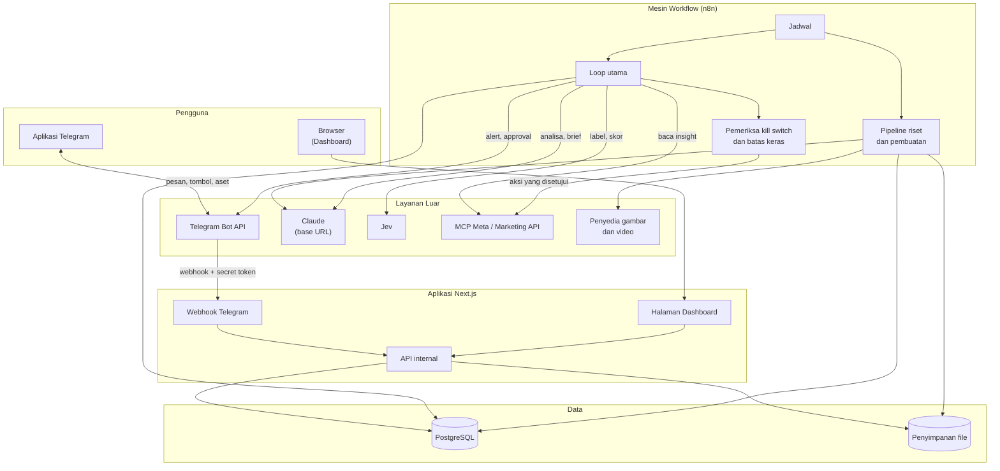

### Alur Tahap 1 sampai 4 (Riset sampai Paket Creative)
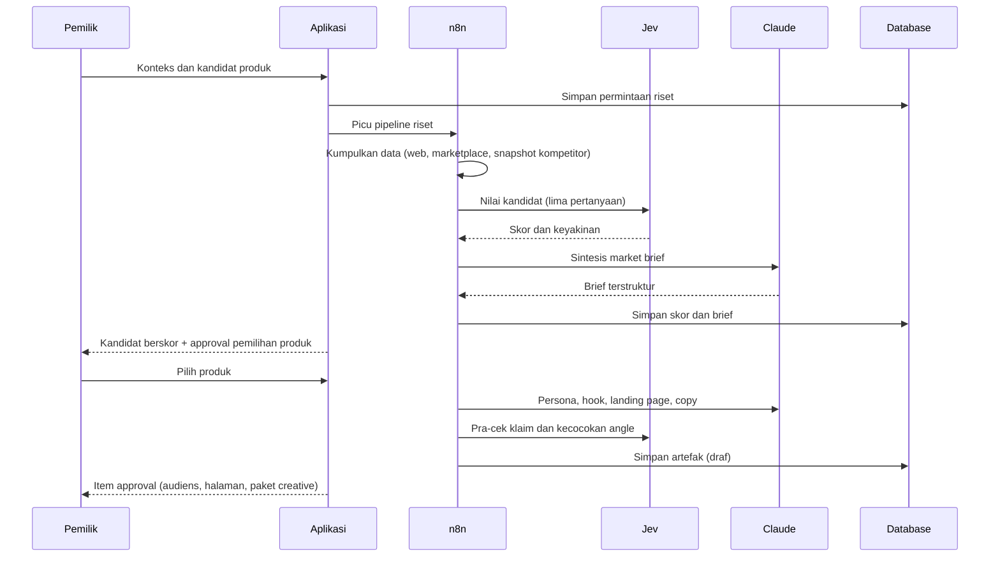

### Alur Brief Manual ke Insight Produk
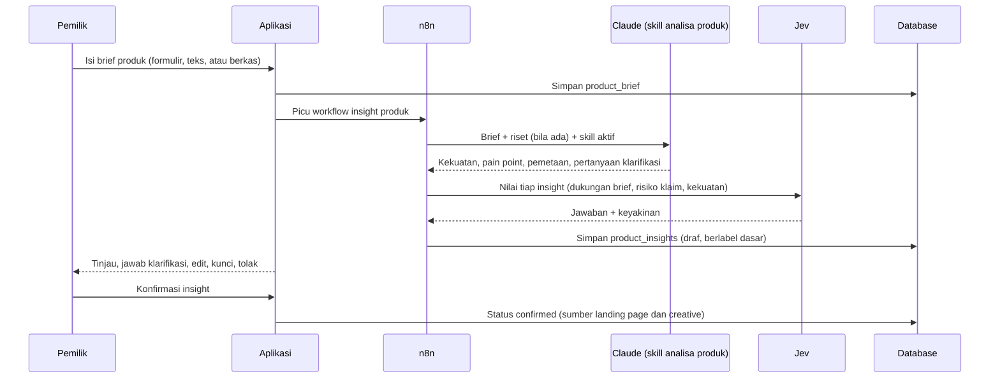

### Alur Peluncuran dan A/B Test (Tahap 5)
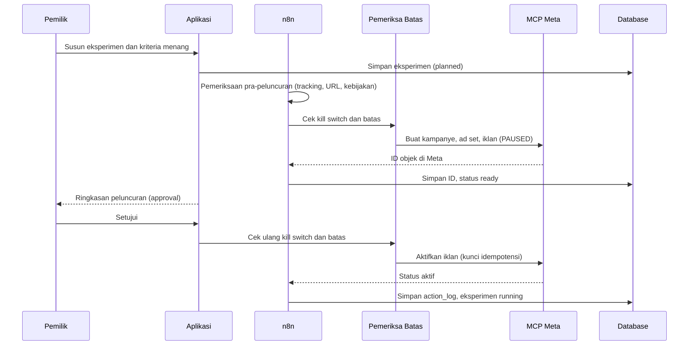

### Alur Loop Utama (Tahap 6)
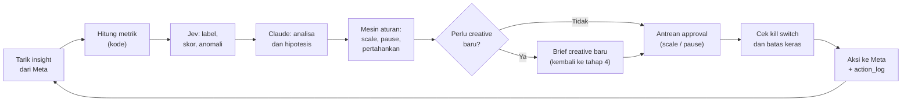

### Status Campaign/Iklan
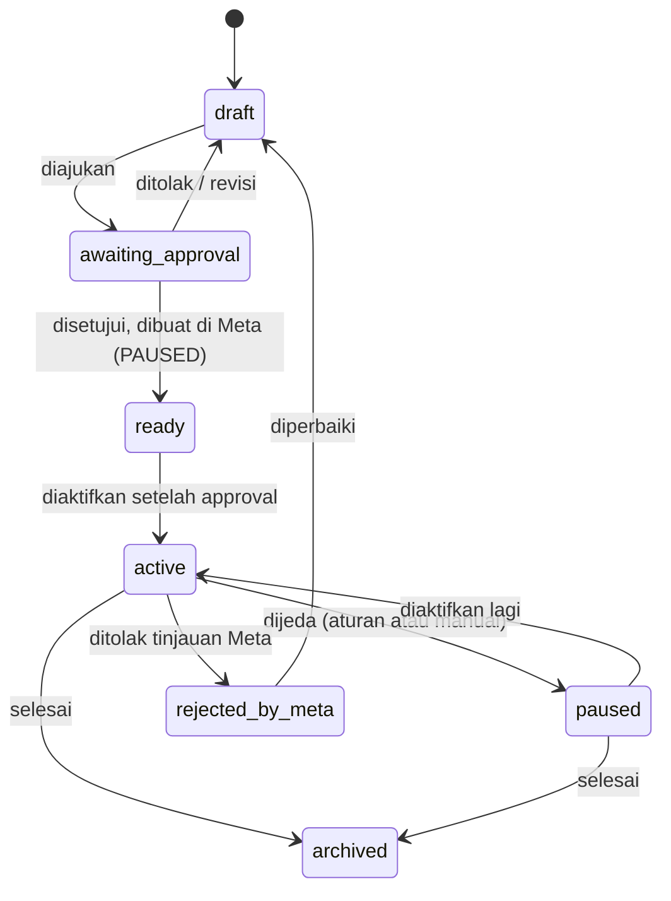

### Status Eksperimen
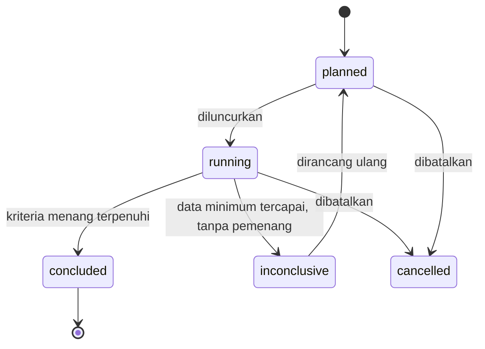

### Status Approval
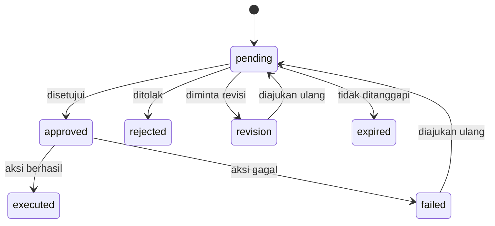

### Status Creative
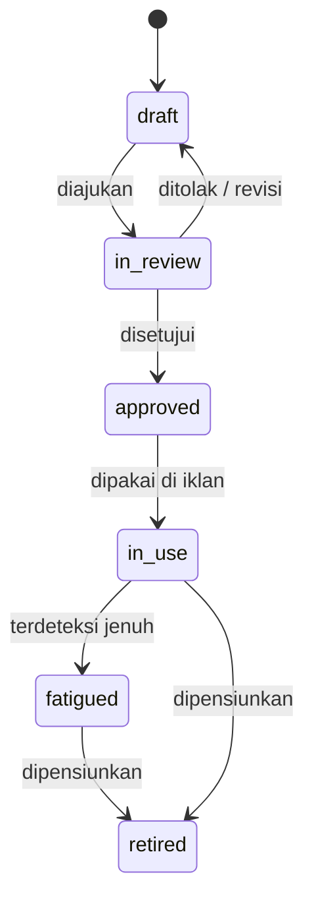

### Alur Revisi dari Komentar (Landing Page dan Creative)
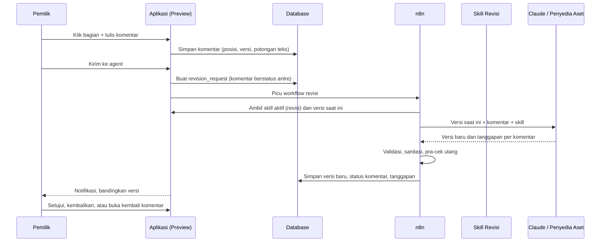

### Status Komentar Revisi
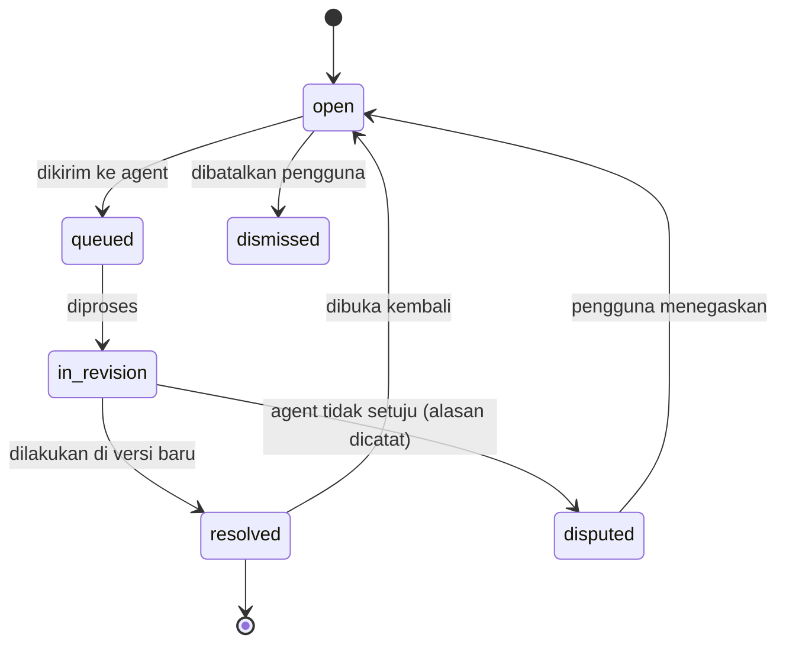

### Kontrak API Utama
| Endpoint | Fungsi | Pemanggil |
|---|---|---|
| `POST /api/telegram/webhook` | Menerima pesan, aset, dan callback tombol | Telegram |
| `POST /api/workflows/:nama/trigger` | Memicu pipeline (riset, creative, laporan) dengan secret | Dashboard, bot, n8n |
| `POST /api/workflows/callback` | Menerima hasil dan status dari n8n | n8n (dengan secret) |
| `GET /api/auth/link?token=…` | Menukar tautan sekali pakai menjadi sesi | Browser |
| `GET /api/approvals` | Daftar item approval | Dashboard, bot |
| `POST /api/approvals/:id/decide` | Setujui, tolak, atau minta revisi | Dashboard, bot |
| `POST /api/control/kill`, `POST /api/control/resume` | Mengaktifkan atau menonaktifkan kill switch | Dashboard, bot (resume hanya pemilik) |
| `GET /api/landing-pages/:id/download` | Mengunduh HTML atau ZIP landing page (bersih dari skrip preview) | Dashboard |
| `GET /api/previews/:subject_type/:id` | Mengambil sumber preview (URL bertanda tangan, peta blok, daftar versi) | Dashboard |
| `GET /api/preview-comments?subject_type=&subject_id=&version=` | Daftar komentar pada suatu versi | Dashboard |
| `POST /api/preview-comments` | Membuat komentar (posisi, jenis, isi) | Dashboard |
| `PATCH /api/preview-comments/:id` | Mengubah isi, membuka kembali, atau membatalkan komentar | Dashboard |
| `POST /api/revisions` | Membuat permintaan revisi dari sekumpulan komentar dan memicu workflow | Dashboard |
| `GET /api/revisions/:id` | Status dan hasil revisi (versi baru, tanggapan per komentar) | Dashboard, n8n |
| `POST /api/revisions/:id/restore` | Mengembalikan versi lama sebagai versi aktif | Dashboard (pemilik) |
| `POST /api/products`, `PATCH /api/products/:id/brief` | Membuat produk dari brief manual atau memperbarui brief (membuat versi baru) | Dashboard, bot |
| `POST /api/products/:id/insights/generate` | Memicu pembuatan insight dari brief (dan riset bila ada) | Dashboard, bot |
| `PATCH /api/product-insights/:id` | Mengedit, mengunci, menolak, atau mengonfirmasi satu insight | Dashboard |
| `POST /api/products/:id/insights/confirm` | Mengonfirmasi satu set insight sebagai sumber landing page dan creative | Dashboard (pemilik) |
| `GET /api/skills`, `GET /api/skills/:id` | Daftar skill dan detail beserta versi | Dashboard |
| `PUT /api/skills/:id` | Menyimpan perubahan sebagai versi draf baru | Dashboard |
| `POST /api/skills/:id/test` | Menguji versi pada contoh masukan | Dashboard |
| `POST /api/skills/:id/activate` | Mengaktifkan atau mengembalikan versi | Dashboard (pemilik) |
| `GET /api/skills/active?key=` | Mengambil skill aktif untuk suatu tahap | n8n (dengan secret) |
| `PATCH /api/rules` | Mengubah aturan, batas, dan ambang | Dashboard (pemilik) |
| `GET /api/export/:jenis` | Ekspor Excel atau PDF (laporan, performa, creative) | Dashboard |
| `PATCH /api/settings` | Mengubah pengaturan | Dashboard (pemilik) |

### Contoh Muatan Penilaian Jev
```json
{
  "subject_type": "ad",
  "subject_id": "uuid",
  "question_key": "creative_fatigue",
  "answer": "ya",
  "probabilities": { "ya": 0.91, "tidak": 0.09 },
  "confidence": 0.91,
  "threshold": 0.8,
  "forwarded": false,
  "model": "jev",
  "config_version": 3
}
```

### Contoh Muatan Usulan Aksi (Scale)
```json
{
  "kind": "scale",
  "ad_set_id": "uuid",
  "current_daily_budget": 150000,
  "proposed_daily_budget": 180000,
  "change_pct": 20,
  "reasons": [
    "CPA di bawah target 4 hari berturut-turut",
    "38 hasil dalam 4 hari (minimum 30)",
    "Tracking sehat"
  ],
  "limits_checked": { "max_step_pct": true, "min_gap_hours": true, "daily_cap": true, "kill_switch": false },
  "idempotency_key": "scale:uuid:2026-10-07",
  "mode": "suggest_approve"
}
```

### Fungsi Kueri untuk Tanya Jawab (contoh)
`get_summary(period)`, `get_ad_performance(campaign?, ad_set?, period)`, `get_angle_performance(period)`, `get_creative_fatigue()`, `get_experiment_status(experiment?)`, `get_pending_approvals()`, `get_spend_pacing()`, `get_competitor_mix(competitor?, period)`, `run_readonly_sql(query)` *(cadangan, dibatasi pada view yang diizinkan)*.

### Struktur Folder
```
ads-loop/
├── app/
│   ├── (dashboard)/            # /, riset, audiens, kompetitor, landing-page, creative, kampanye, eksperimen, approval, laporan, aturan, pengaturan, log
│   ├── login/
│   └── api/
│       ├── telegram/webhook/   # Penerima webhook
│       ├── workflows/          # Pemicu dan callback n8n
│       ├── approvals/          # Daftar dan keputusan approval
│       ├── control/            # Kill switch
│       ├── landing-pages/      # Unduh HTML/ZIP
│       ├── auth/               # Tautan masuk sekali pakai
│       └── export/             # Ekspor Excel/PDF
├── src/
│   ├── bot/                    # Penangan pesan, perintah, tombol, templat balasan
│   ├── ai/                     # Klien Claude (base URL), klien Jev (judge), prompt, skema keluaran
│   ├── meta/                   # Lapisan integrasi MCP Meta/Marketing API, pemetaan objek, kunci idempotensi
│   ├── domain/                 # Produk, audiens, angle, creative, kampanye, eksperimen, approval
│   ├── rules/                  # Mesin aturan, batas keras, pemicu creative baru
│   ├── reports/                # Metrik, performa per angle, kejenuhan, pacing
│   ├── generators/             # Pembuat landing page HTML, paket creative, penamaan dan tag
│   ├── preview/                # Sandbox preview, penanda blok, skrip komentar (hanya preview), diff versi
│   ├── revisions/              # Pengumpul komentar, penyusun permintaan revisi, validasi dan sanitasi hasil
│   ├── skills/                 # Penyimpanan, versi, pengikatan, dan penguji skill agent
│   ├── db/                     # Skema, migrasi, view baca-saja (Neon Postgres)
│   ├── storage/                # Klien S3 (Neon Object Storage), URL bertanda tangan, unggah dan unduh
│   └── lib/                    # Auth, format Rupiah dan tanggal, validasi, audit
├── n8n/
│   └── workflows/              # Ekspor workflow (sinkronisasi, loop harian, riset, creative, laporan)
├── templates/                  # Templat landing page, templat brief, templat laporan
└── tests/                      # Uji batas keras, aturan scale, validasi skema AI, set uji penilaian Jev
```

---

## 6. Database Schema

Database memakai **PostgreSQL**. Semua nominal disimpan sebagai bilangan bulat Rupiah (`bigint`). Tanggal dan waktu memakai zona waktu Asia/Jakarta pada tampilan. Data yang dihapus memakai kolom `deleted_at` (*soft delete*). Angka turunan (CPA, ROAS, CTR) tidak disimpan sebagai sumber kebenaran; dihitung di *view* dari data mentah.

### Tabel

#### `users` — Pengguna
| Field | Tipe | Kegunaan |
|---|---|---|
| `id` | uuid | Pengenal |
| `telegram_user_id` | bigint (unik) | ID akun Telegram |
| `telegram_chat_id` | bigint | Obrolan pribadi dengan bot |
| `name` | string | Nama tampilan |
| `role` | enum (`owner`, `admin`) | Peran |
| `is_active` | boolean | Aktif/nonaktif |
| `created_at` | datetime | Waktu dibuat |

#### `login_links` — Tautan Masuk
| Field | Tipe | Kegunaan |
|---|---|---|
| `id` | uuid | Pengenal |
| `user_id` | uuid → `users` | Pemilik tautan |
| `token_hash` | string | Hash token (token asli tidak disimpan) |
| `expires_at` | datetime | Kedaluwarsa |
| `used_at` | datetime (boleh kosong) | Waktu dipakai |

#### `products` — Produk dan Kandidat
| Field | Tipe | Kegunaan |
|---|---|---|
| `id` | uuid | Pengenal |
| `name` | string | Nama produk |
| `kind` | enum (`online_physical`, `digital`, `offline_service`, `other`) | Jenis produk |
| `context` | jsonb | Konteks pemilik: lokasi/radius, modal, margin minimum, batasan |
| `origin` | enum (`research`, `manual_brief`) | Jalur masuk produk |
| `status` | enum (`candidate`, `selected`, `rejected`, `archived`) | Status dalam seleksi |
| `selected_at` | datetime (boleh kosong) | Waktu dipilih |
| `created_by` | uuid → `users` | Pembuat |
| `created_at` | datetime | Waktu dibuat |
| `deleted_at` | datetime (boleh kosong) | Penanda hapus |

#### `product_briefs` — Brief Produk Manual
| Field | Tipe | Kegunaan |
|---|---|---|
| `id` | uuid | Pengenal |
| `product_id` | uuid → `products` | Produk |
| `version` | integer | Versi brief |
| `mode` | enum (`quick`, `full`, `free_text`) | Cara pengisian |
| `description` | text | Deskripsi produk |
| `price_info` | jsonb | Harga, varian, dan paket |
| `specs` | text (boleh kosong) | Spesifikasi, bahan, atau isi paket |
| `owner_strengths` | text (boleh kosong) | Kelebihan menurut pemilik |
| `target_buyer` | text (boleh kosong) | Calon pembeli menurut pemilik |
| `problems_solved` | text (boleh kosong) | Masalah yang diselesaikan menurut pemilik |
| `differentiators` | text (boleh kosong) | Pembeda dari kompetitor |
| `proof` | jsonb | Bukti: testimoni, sertifikasi, angka, dan ID berkas di `uploads` |
| `claim_limits` | text (boleh kosong) | Hal yang tidak boleh diklaim |
| `offer_guarantee` | text (boleh kosong) | Penawaran dan garansi |
| `order_channel` | text (boleh kosong) | Cara order atau lokasi |
| `tone_notes` | text (boleh kosong) | Nada bahasa yang diinginkan |
| `raw_text` | text (boleh kosong) | Teks bebas yang ditempel pengguna |
| `clarifications` | jsonb | Pertanyaan klarifikasi dari agent dan jawaban pemilik |
| `status` | enum (`draft`, `submitted`, `superseded`) | Status |
| `created_by` | uuid → `users` | Pembuat |
| `created_at` | datetime | Waktu dibuat |

#### `product_insights` — Insight Produk (Kekuatan dan Pain Point)
| Field | Tipe | Kegunaan |
|---|---|---|
| `id` | uuid | Pengenal |
| `product_id` | uuid → `products` | Produk |
| `brief_id` | uuid → `product_briefs` (boleh kosong) | Versi brief asal |
| `kind` | enum (`strength`, `pain_point`, `objection`) | Jenis insight |
| `strength_type` | enum (`feature`, `benefit`, `emotional`, `differentiator`) (boleh kosong) | Jenis kekuatan (untuk `strength`) |
| `statement` | text | Pernyataan singkat |
| `detail` | text (boleh kosong) | Penjelasan atau contoh |
| `basis` | enum (`from_brief`, `from_research`, `ai_inference`, `user_added`) | Dasar insight |
| `proof_status` | enum (`verified`, `needs_proof`, `unverifiable`) | Status bukti |
| `claim_risk` | enum (`low`, `medium`, `high`) | Risiko klaim (penilaian Jev) |
| `intensity` | enum (`low`, `medium`, `high`) (boleh kosong) | Intensitas masalah (untuk `pain_point`) |
| `audience_phrases` | jsonb | Frasa yang mungkin dipakai audiens |
| `linked_to` | jsonb | Pemetaan ke insight lain (pain point ke kekuatan yang menjawabnya) |
| `suggested_angle` | text (boleh kosong) | Usulan angle atau arah headline |
| `confidence` | numeric | Keyakinan penilaian Jev |
| `priority` | integer | Urutan prioritas |
| `pinned` | boolean | Dikunci pengguna (tidak ikut dihasilkan ulang) |
| `status` | enum (`draft`, `confirmed`, `rejected`, `needs_review`) | Status |
| `skill_version_id` | uuid → `agent_skill_versions` (boleh kosong) | Versi skill yang menghasilkan |
| `created_at` | datetime | Waktu dibuat |
| `updated_at` | datetime | Waktu diubah |

#### `market_briefs` — Market Brief
| Field | Tipe | Kegunaan |
|---|---|---|
| `id` | uuid | Pengenal |
| `product_id` | uuid → `products` | Produk |
| `version` | integer | Versi brief |
| `demand_summary` | text | Ringkasan permintaan |
| `price_min` | bigint (boleh kosong) | Harga pasar terendah |
| `price_max` | bigint (boleh kosong) | Harga pasar tertinggi |
| `competitors` | jsonb | Ringkasan kompetitor |
| `gaps` | text | Celah pasar |
| `risks` | text | Risiko |
| `validation_plan` | text | Rencana tes validasi |
| `sources` | jsonb | Sumber data dan tanggal pengambilan |
| `content_md` | text | Isi lengkap brief |
| `created_at` | datetime | Waktu dibuat |

#### `audience_profiles` — Profil Audiens
| Field | Tipe | Kegunaan |
|---|---|---|
| `id` | uuid | Pengenal |
| `product_id` | uuid → `products` | Produk |
| `name` | string | Nama persona |
| `description` | text | Situasi dan hasil yang diinginkan |
| `pains` | jsonb | Masalah utama |
| `objections` | jsonb | Keberatan membeli |
| `language_notes` | text | Kata dan frasa yang dipakai audiens |
| `targeting_suggestion` | jsonb | Usulan targeting awal |
| `status` | enum (`draft`, `approved`, `retired`) | Status |
| `created_at` | datetime | Waktu dibuat |

#### `angles` — Angle Pesan
| Field | Tipe | Kegunaan |
|---|---|---|
| `id` | uuid | Pengenal (menjadi `angle_id`) |
| `product_id` | uuid → `products` | Produk |
| `audience_id` | uuid → `audience_profiles` (boleh kosong) | Persona sasaran |
| `name` | string | Nama angle |
| `description` | text | Penjelasan pendekatan |
| `hook_examples` | jsonb | Contoh hook |
| `origin` | enum (`research`, `competitor_gap`, `winner_variation`, `manual`) | Asal angle |
| `status` | enum (`idea`, `testing`, `winning`, `saturated`, `retired`) | Status |
| `created_at` | datetime | Waktu dibuat |

#### `landing_pages` — Landing Page
| Field | Tipe | Kegunaan |
|---|---|---|
| `id` | uuid | Pengenal |
| `product_id` | uuid → `products` | Produk |
| `angle_id` | uuid → `angles` | Angle yang dilayani |
| `version` | integer | Versi |
| `previous_id` | uuid → `landing_pages` (boleh kosong) | Versi sebelumnya (setiap revisi membuat baris baru) |
| `blocks` | jsonb | Peta blok halaman (ID blok, jenis, potongan teks) untuk penanda komentar |
| `insight_ids` | jsonb | ID insight produk yang dipakai sebagai dasar klaim di halaman |
| `skill_version_id` | uuid → `agent_skill_versions` (boleh kosong) | Versi skill yang menghasilkan halaman |
| `title` | string | Judul internal |
| `file_upload_id` | uuid → `uploads` | File HTML atau ZIP |
| `size_kb` | integer | Ukuran file |
| `live_url` | string (boleh kosong) | URL setelah dipasang pengguna |
| `precheck` | jsonb | Hasil pra-cek (kecocokan pesan, klaim berisiko) |
| `status` | enum (`draft`, `in_review`, `approved`, `deployed`, `retired`) | Status |
| `created_by` | uuid → `users` | Pembuat |
| `created_at` | datetime | Waktu dibuat |
| `deleted_at` | datetime (boleh kosong) | Penanda hapus |

#### `creatives` — Creative
| Field | Tipe | Kegunaan |
|---|---|---|
| `id` | uuid | Pengenal |
| `product_id` | uuid → `products` | Produk |
| `angle_id` | uuid → `angles` | Angle |
| `name` | string | Nama sesuai konvensi (produk-angle-format-versi) |
| `format` | enum (`image`, `video`, `carousel`) | Format |
| `primary_text` | text | Teks utama |
| `headline` | string | Headline |
| `description` | string | Deskripsi |
| `cta` | string | Tombol ajakan |
| `landing_page_id` | uuid → `landing_pages` (boleh kosong) | Halaman tujuan |
| `parent_creative_id` | uuid → `creatives` (boleh kosong) | Creative asal bila ini variasi |
| `version` | integer | Versi (naik pada setiap revisi) |
| `previous_id` | uuid → `creatives` (boleh kosong) | Versi sebelumnya bila ini hasil revisi |
| `skill_version_id` | uuid → `agent_skill_versions` (boleh kosong) | Versi skill yang menghasilkan creative |
| `precheck` | jsonb | Risiko klaim, skor hook, kecocokan angle |
| `status` | enum (`draft`, `in_review`, `approved`, `in_use`, `fatigued`, `retired`) | Status |
| `created_at` | datetime | Waktu dibuat |
| `deleted_at` | datetime (boleh kosong) | Penanda hapus |

#### `creative_assets` — Aset Creative
| Field | Tipe | Kegunaan |
|---|---|---|
| `id` | uuid | Pengenal |
| `creative_id` | uuid → `creatives` | Creative |
| `kind` | enum (`image`, `video`, `thumbnail`) | Jenis aset |
| `source` | enum (`ai_generated`, `uploaded`) | Asal aset |
| `upload_id` | uuid → `uploads` | File |
| `aspect_ratio` | string | Mis. `1:1`, `4:5`, `9:16` |
| `duration_sec` | integer (boleh kosong) | Durasi video |
| `provider` | string (boleh kosong) | Penyedia pembuat aset |
| `prompt` | text (boleh kosong) | Prompt atau brief visual |
| `created_at` | datetime | Waktu dibuat |

#### `campaigns` — Kampanye
| Field | Tipe | Kegunaan |
|---|---|---|
| `id` | uuid | Pengenal |
| `product_id` | uuid → `products` | Produk |
| `meta_campaign_id` | string (boleh kosong) | ID di Meta |
| `name` | string | Nama |
| `objective` | string | Objektif kampanye |
| `status` | enum (`draft`, `awaiting_approval`, `ready`, `active`, `paused`, `rejected_by_meta`, `archived`) | Status internal |
| `meta_status` | string (boleh kosong) | Status efektif terakhir dari Meta |
| `created_at` | datetime | Waktu dibuat |

#### `ad_sets` — Ad Set
| Field | Tipe | Kegunaan |
|---|---|---|
| `id` | uuid | Pengenal |
| `campaign_id` | uuid → `campaigns` | Kampanye |
| `experiment_id` | uuid → `experiments` (boleh kosong) | Eksperimen terkait |
| `meta_adset_id` | string (boleh kosong) | ID di Meta |
| `name` | string | Nama |
| `daily_budget` | bigint | Budget harian |
| `targeting` | jsonb | Targeting |
| `optimization_goal` | string | Sasaran optimasi |
| `status` | enum (sama dengan `campaigns.status`) | Status internal |
| `last_scaled_at` | datetime (boleh kosong) | Waktu scale terakhir (untuk aturan jeda) |
| `created_at` | datetime | Waktu dibuat |

#### `ads` — Iklan
| Field | Tipe | Kegunaan |
|---|---|---|
| `id` | uuid | Pengenal |
| `ad_set_id` | uuid → `ad_sets` | Ad set |
| `creative_id` | uuid → `creatives` | Creative yang dipakai |
| `angle_id` | uuid → `angles` | Angle (disalin untuk analisa cepat) |
| `meta_ad_id` | string (boleh kosong) | ID di Meta |
| `name` | string | Nama |
| `status` | enum (sama dengan `campaigns.status`) | Status internal |
| `meta_status` | string (boleh kosong) | Status efektif dari Meta |
| `created_at` | datetime | Waktu dibuat |

#### `ad_insights` — Data Performa Iklan
| Field | Tipe | Kegunaan |
|---|---|---|
| `id` | uuid | Pengenal |
| `ad_id` | uuid → `ads` | Iklan |
| `date` | date | Tanggal data |
| `granularity` | enum (`hourly`, `daily`) | Tingkat rincian |
| `hour` | integer (boleh kosong) | Jam untuk data per jam |
| `spend` | bigint | Biaya |
| `impressions` | integer | Impresi |
| `reach` | integer | Jangkauan |
| `link_clicks` | integer | Klik tautan |
| `results` | integer | Hasil sesuai objektif |
| `result_value` | bigint | Nilai hasil (mis. pendapatan) bila ada |
| `frequency` | numeric | Frekuensi |
| `fetched_at` | datetime | Waktu pengambilan |

#### `experiments` — Eksperimen A/B
| Field | Tipe | Kegunaan |
|---|---|---|
| `id` | uuid | Pengenal |
| `product_id` | uuid → `products` | Produk |
| `name` | string | Nama |
| `variable` | enum (`angle`, `visual`, `offer`, `audience`, `landing_page`) | Variabel yang diuji (satu per eksperimen) |
| `hypothesis` | text | Hipotesis |
| `primary_metric` | string | Metrik penentu (mis. CPA) |
| `min_data_rule` | jsonb | Ukuran data minimum (hasil, klik, hari) |
| `win_rule` | jsonb | Kriteria menang yang ditulis sebelum aktif |
| `total_budget` | bigint | Budget total |
| `start_date` | date (boleh kosong) | Mulai |
| `end_date` | date (boleh kosong) | Selesai |
| `status` | enum (`planned`, `running`, `concluded`, `inconclusive`, `cancelled`) | Status |
| `winner_arm_id` | uuid → `experiment_arms` (boleh kosong) | Varian pemenang |
| `conclusion` | text (boleh kosong) | Kesimpulan |
| `created_at` | datetime | Waktu dibuat |

#### `experiment_arms` — Varian Eksperimen
| Field | Tipe | Kegunaan |
|---|---|---|
| `id` | uuid | Pengenal |
| `experiment_id` | uuid → `experiments` | Eksperimen |
| `label` | string | Nama varian (A, B, …) |
| `ad_set_id` | uuid → `ad_sets` (boleh kosong) | Ad set varian |
| `angle_id` | uuid → `angles` (boleh kosong) | Angle varian |
| `creative_id` | uuid → `creatives` (boleh kosong) | Creative varian |

#### `competitors` — Kompetitor
| Field | Tipe | Kegunaan |
|---|---|---|
| `id` | uuid | Pengenal |
| `product_id` | uuid → `products` (boleh kosong) | Produk terkait |
| `name` | string | Nama brand |
| `page_url` | string (boleh kosong) | Halaman Facebook/Instagram |
| `ad_library_url` | string (boleh kosong) | URL Ad Library |
| `source` | enum (`manual`, `provider`) | Cara data masuk |
| `is_active` | boolean | Dipantau atau tidak |
| `created_at` | datetime | Waktu dibuat |

#### `competitor_ads` — Snapshot Iklan Kompetitor
| Field | Tipe | Kegunaan |
|---|---|---|
| `id` | uuid | Pengenal |
| `competitor_id` | uuid → `competitors` | Kompetitor |
| `external_ref` | string (boleh kosong) | ID atau referensi dari sumber |
| `snapshot_date` | date | Tanggal pengambilan |
| `first_seen_date` | date | Pertama kali terlihat |
| `last_seen_date` | date | Terakhir terlihat |
| `primary_text` | text | Teks utama |
| `headline` | string | Headline |
| `cta` | string | Tombol ajakan |
| `destination_url` | string | URL tujuan |
| `format` | enum (`image`, `video`, `carousel`, `unknown`) | Format |
| `variant_group` | string (boleh kosong) | Kelompok variasi satu konsep |
| `days_running` | integer | Lama tayang (perkiraan) |
| `labels` | jsonb | Label Jev (angle, tipe hook, penawaran, tahap funnel, urgensi) |
| `upload_id` | uuid → `uploads` (boleh kosong) | Tangkapan layar atau media |

#### `judgment_questions` — Pertanyaan Penilaian Jev
| Field | Tipe | Kegunaan |
|---|---|---|
| `id` | uuid | Pengenal |
| `key` | string (unik per versi) | Mis. `creative_fatigue`, `claim_risk`, `angle_label` |
| `applies_to` | enum (`ad`, `creative`, `landing_page`, `competitor_ad`, `comment`, `product`, `product_insight`) | Jenis objek yang dinilai |
| `prompt` | text | Rumusan pertanyaan |
| `answer_type` | enum (`choice`, `ordinal`, `boolean`) | Jenis jawaban |
| `options` | jsonb | Pilihan jawaban |
| `threshold` | numeric | Ambang keyakinan |
| `version` | integer | Versi |
| `is_active` | boolean | Aktif atau tidak |

#### `judgments` — Hasil Penilaian
| Field | Tipe | Kegunaan |
|---|---|---|
| `id` | uuid | Pengenal |
| `question_id` | uuid → `judgment_questions` | Pertanyaan |
| `subject_type` | string | Jenis objek |
| `subject_id` | uuid | ID objek |
| `answer` | string | Jawaban terpilih |
| `probabilities` | jsonb | Probabilitas tiap pilihan |
| `confidence` | numeric | Tingkat keyakinan |
| `forwarded` | boolean | Diteruskan ke Claude atau manusia karena di bawah ambang |
| `human_answer` | string (boleh kosong) | Penilaian manusia untuk evaluasi |
| `model` | string | Model yang menilai (Jev atau fallback) |
| `created_at` | datetime | Waktu dibuat |

#### `analyses` — Hasil Analisa Claude
| Field | Tipe | Kegunaan |
|---|---|---|
| `id` | uuid | Pengenal |
| `kind` | enum (`daily_report`, `weekly_report`, `experiment_review`, `competitor_map`, `creative_brief`) | Jenis analisa |
| `period_start` | date (boleh kosong) | Awal periode |
| `period_end` | date (boleh kosong) | Akhir periode |
| `content_md` | text | Isi analisa |
| `facts` | jsonb | Angka dan temuan faktual yang dipakai |
| `hypotheses` | jsonb | Dugaan penyebab, ditandai sebagai dugaan |
| `recommendations` | jsonb | Rekomendasi |
| `model` | string | Model yang dipakai |
| `created_at` | datetime | Waktu dibuat |

#### `rules` — Aturan dan Batas
| Field | Tipe | Kegunaan |
|---|---|---|
| `id` | uuid | Pengenal |
| `key` | string | Mis. `scale`, `pause`, `fatigue`, `new_creative`, `hard_caps` |
| `params` | jsonb | Parameter (persentase, jeda, ambang, batas harian) |
| `mode` | enum (`suggest_approve`, `auto`) | Mode operasi |
| `is_active` | boolean | Aktif atau tidak |
| `version` | integer | Versi |
| `updated_by` | uuid → `users` | Pengubah terakhir |
| `updated_at` | datetime | Waktu diubah |

#### `approvals` — Antrean Approval
| Field | Tipe | Kegunaan |
|---|---|---|
| `id` | uuid | Pengenal |
| `kind` | enum (`product`, `audience`, `landing_page`, `creative_pack`, `launch`, `scale`, `pause`, `new_creative`, `experiment_winner`) | Jenis item |
| `subject_type` | string | Jenis objek terkait |
| `subject_id` | uuid | ID objek terkait |
| `title` | string | Judul ringkas |
| `summary` | text | Ringkasan |
| `reasons` | jsonb | Alasan dan angka pendukung |
| `payload` | jsonb | Muatan aksi yang akan dijalankan |
| `status` | enum (`pending`, `approved`, `rejected`, `revision`, `expired`, `executed`, `failed`) | Status |
| `requested_at` | datetime | Waktu diajukan |
| `expires_at` | datetime (boleh kosong) | Kedaluwarsa |
| `decided_by` | uuid → `users` (boleh kosong) | Pemutus |
| `decided_at` | datetime (boleh kosong) | Waktu keputusan |
| `decision_note` | text (boleh kosong) | Catatan keputusan atau revisi |
| `error` | text (boleh kosong) | Pesan galat bila aksi gagal |

#### `action_log` — Log Aksi ke Meta
| Field | Tipe | Kegunaan |
|---|---|---|
| `id` | uuid | Pengenal |
| `approval_id` | uuid → `approvals` (boleh kosong) | Persetujuan yang mendasari |
| `action` | string | Mis. `create_campaign`, `activate_ad`, `set_budget`, `pause_ad` |
| `target_type` | string | Jenis objek |
| `target_id` | uuid | ID objek internal |
| `meta_object_id` | string (boleh kosong) | ID objek di Meta |
| `request` | jsonb | Permintaan yang dikirim (tanpa kredensial) |
| `response` | jsonb | Jawaban Meta |
| `idempotency_key` | string (unik) | Mencegah aksi ganda |
| `mode` | enum (`manual_approved`, `auto`) | Cara aksi dijalankan |
| `status` | enum (`sent`, `confirmed`, `failed`) | Status |
| `created_at` | datetime | Waktu dibuat |

#### `jobs` — Eksekusi Workflow
| Field | Tipe | Kegunaan |
|---|---|---|
| `id` | uuid | Pengenal |
| `workflow_key` | string | Mis. `research`, `landing_page`, `creative_pack`, `daily_loop`, `weekly_report` |
| `trigger` | enum (`cron`, `user`, `system`) | Pemicu |
| `skill_version_id` | uuid → `agent_skill_versions` (boleh kosong) | Versi skill yang dipakai eksekusi |
| `status` | enum (`queued`, `running`, `succeeded`, `failed`) | Status |
| `input` | jsonb | Masukan |
| `error` | text (boleh kosong) | Pesan galat |
| `started_at` | datetime (boleh kosong) | Mulai |
| `finished_at` | datetime (boleh kosong) | Selesai |

#### `uploads` — Berkas
| Field | Tipe | Kegunaan |
|---|---|---|
| `id` | uuid | Pengenal |
| `kind` | enum (`asset`, `landing_page`, `screenshot`, `document`, `export`) | Jenis berkas |
| `bucket` | string | Nama bucket di Neon Object Storage |
| `storage_path` | string | Kunci objek di bucket (bukan URL publik) |
| `mime_type` | string | Tipe berkas |
| `size_bytes` | integer | Ukuran |
| `file_hash` | string | Hash untuk deteksi duplikat |
| `created_by` | uuid → `users` (boleh kosong) | Pengunggah |
| `created_at` | datetime | Waktu dibuat |

#### `chat_messages` — Riwayat Obrolan
| Field | Tipe | Kegunaan |
|---|---|---|
| `id` | uuid | Pengenal |
| `user_id` | uuid → `users` | Pengguna |
| `role` | enum (`user`, `assistant`) | Pengirim |
| `content` | text | Isi pesan |
| `created_at` | datetime | Waktu dibuat |

#### `telegram_updates` — Pencegah Duplikat
| Field | Tipe | Kegunaan |
|---|---|---|
| `update_id` | bigint (kunci utama) | ID update Telegram |
| `received_at` | datetime | Waktu diterima |

#### `ai_usage` — Pemakaian AI
| Field | Tipe | Kegunaan |
|---|---|---|
| `id` | uuid | Pengenal |
| `user_id` | uuid → `users` (boleh kosong) | Pengguna pemicu |
| `provider` | enum (`claude`, `jev`, `image`, `video`) | Jenis layanan |
| `purpose` | string | Mis. `market_brief`, `copywriting`, `judge`, `daily_report` |
| `model` | string | Model |
| `input_tokens` | integer (boleh kosong) | Token masukan |
| `output_tokens` | integer (boleh kosong) | Token keluaran |
| `cost_idr` | bigint | Perkiraan biaya |
| `created_at` | datetime | Waktu dibuat |

#### `settings` — Pengaturan
| Field | Tipe | Kegunaan |
|---|---|---|
| `key` | string (kunci utama) | Nama pengaturan (mis. `kill_switch_active`, `target_cpa`, `ai_daily_cap`, `ai_monthly_cap`, `active_product_id`) |
| `value` | jsonb | Nilai |
| `updated_by` | uuid → `users` (boleh kosong) | Pengubah terakhir |
| `updated_at` | datetime | Waktu diubah |

#### `audit_log` — Log Audit
| Field | Tipe | Kegunaan |
|---|---|---|
| `id` | uuid | Pengenal |
| `user_id` | uuid → `users` (boleh kosong) | Pelaku (kosong bila sistem) |
| `action` | enum (`create`, `update`, `delete`, `approve`, `reject`, `kill`, `resume`) | Jenis aksi |
| `entity_type` | string | Jenis objek |
| `entity_id` | uuid | ID objek |
| `before` | jsonb (boleh kosong) | Nilai sebelum |
| `after` | jsonb (boleh kosong) | Nilai sesudah |
| `created_at` | datetime | Waktu dibuat |

#### `preview_comments` — Komentar Preview
| Field | Tipe | Kegunaan |
|---|---|---|
| `id` | uuid | Pengenal |
| `subject_type` | enum (`landing_page`, `creative`) | Jenis objek |
| `subject_id` | uuid | ID versi objek yang dikomentari |
| `kind` | enum (`change`, `replace_text`, `question`) | Jenis komentar |
| `anchor_type` | enum (`block`, `text_range`, `image_area`, `video_time`, `general`) | Jenis penanda posisi |
| `anchor` | jsonb | Posisi: ID blok, rentang karakter, area gambar (persen), atau detik/adegan video |
| `anchor_snapshot` | text (boleh kosong) | Potongan teks atau deskripsi bagian saat komentar dibuat |
| `body` | text | Isi komentar (maks. 2.000 karakter) |
| `replacement_text` | text (boleh kosong) | Teks pengganti untuk jenis `replace_text` |
| `status` | enum (`open`, `queued`, `in_revision`, `resolved`, `disputed`, `dismissed`) | Status |
| `revision_request_id` | uuid → `revision_requests` (boleh kosong) | Permintaan revisi yang memprosesnya |
| `agent_response` | text (boleh kosong) | Tanggapan agent |
| `resolved_in_id` | uuid (boleh kosong) | ID versi baru yang menyelesaikan komentar |
| `created_by` | uuid → `users` | Pembuat |
| `created_at` | datetime | Waktu dibuat |

#### `revision_requests` — Permintaan Revisi
| Field | Tipe | Kegunaan |
|---|---|---|
| `id` | uuid | Pengenal |
| `subject_type` | enum (`landing_page`, `creative`) | Jenis objek |
| `base_id` | uuid | Versi dasar yang direvisi |
| `result_id` | uuid (boleh kosong) | Versi baru hasil revisi |
| `status` | enum (`queued`, `running`, `succeeded`, `failed`) | Status |
| `comment_count` | integer | Jumlah komentar yang diproses |
| `job_id` | uuid → `jobs` (boleh kosong) | Eksekusi workflow |
| `skill_version_id` | uuid → `agent_skill_versions` (boleh kosong) | Skill revisi yang dipakai |
| `error` | text (boleh kosong) | Pesan galat |
| `requested_by` | uuid → `users` | Pemohon |
| `created_at` | datetime | Waktu dibuat |

#### `agent_skills` — Skill Agent
| Field | Tipe | Kegunaan |
|---|---|---|
| `id` | uuid | Pengenal |
| `key` | string (unik) | Mis. `market_researcher`, `product_analyst`, `audience_analyst`, `landing_page_builder`, `ad_copywriter`, `creative_director`, `ads_analyst`, `competitor_analyst`, `creative_reviser` |
| `name` | string | Nama tampilan |
| `description` | text | Fungsi skill |
| `model_tier` | enum (`main`, `light`) | Tingkat model yang dipakai |
| `output_schema` | jsonb | Skema keluaran yang divalidasi |
| `status` | enum (`draft`, `active`, `archived`) | Status |
| `active_version_id` | uuid → `agent_skill_versions` (boleh kosong) | Versi aktif |
| `created_by` | uuid → `users` | Pembuat |
| `created_at` | datetime | Waktu dibuat |

#### `agent_skill_versions` — Versi Skill
| Field | Tipe | Kegunaan |
|---|---|---|
| `id` | uuid | Pengenal |
| `skill_id` | uuid → `agent_skills` | Skill |
| `version` | integer | Nomor versi |
| `instructions_md` | text | Instruksi peran, aturan, dan panduan brand |
| `examples` | jsonb | Contoh keluaran baik dan buruk |
| `resources` | jsonb | Referensi (ID `uploads`, playbook) |
| `change_note` | text | Catatan perubahan |
| `test_result` | jsonb (boleh kosong) | Hasil uji terakhir |
| `created_by` | uuid → `users` | Pembuat |
| `created_at` | datetime | Waktu dibuat |

#### `skill_bindings` — Pengikatan Skill ke Tahap
| Field | Tipe | Kegunaan |
|---|---|---|
| `id` | uuid | Pengenal |
| `workflow_key` | string | Tahap atau workflow (mis. `research`, `landing_page`, `creative_pack`, `daily_report`, `revision`) |
| `step_key` | string | Langkah di dalam workflow |
| `skill_id` | uuid → `agent_skills` | Skill yang dipakai |
| `is_active` | boolean | Aktif atau tidak |

### *View* Baca-Saja (untuk Tanya Jawab dan Laporan)
| View | Isi |
|---|---|
| `v_ad_performance` | Metrik per iklan, ad set, dan kampanye: spend, CTR, CPM, CPA, ROAS, frekuensi, dihitung dari `ad_insights` |
| `v_angle_performance` | Performa gabungan per angle dan per creative lintas iklan |
| `v_creative_fatigue` | Tren CTR dan frekuensi per creative beserta penilaian Jev terakhir |
| `v_experiment_status` | Progres data tiap varian terhadap `min_data_rule` dan `win_rule` |
| `v_spend_pacing` | Spend hari ini terhadap batas harian dan budget eksperimen |
| `v_competitor_angle_mix` | Komposisi angle, hook, dan penawaran per kompetitor dan per minggu |
| `v_approval_queue` | Item approval tertunda beserta umur dan kedaluwarsanya |
| `v_judgment_accuracy` | Kesesuaian penilaian Jev dengan penilaian manusia per pertanyaan |

### Diagram Relasi
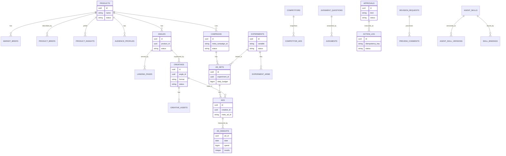

### Kebutuhan Halaman ↔ Tabel
| Halaman | Tabel/View utama |
|---|---|
| `/` | `v_ad_performance`, `v_spend_pacing`, `v_approval_queue`, `settings` |
| `/riset`, `/riset/[id]` | `products`, `market_briefs`, `judgments`, `competitor_ads` |
| `/produk/baru`, `/produk/[id]` | `products`, `product_briefs`, `product_insights`, `judgments` |
| `/audiens` | `audience_profiles`, `angles` |
| `/kompetitor` | `competitors`, `competitor_ads`, `judgments`, `v_competitor_angle_mix` |
| `/landing-page`, `/landing-page/[id]` | `landing_pages`, `angles`, `uploads`, `preview_comments`, `revision_requests` |
| `/creative`, `/creative/[id]` | `creatives`, `creative_assets`, `preview_comments`, `revision_requests`, `v_angle_performance`, `v_creative_fatigue` |
| `/kampanye` | `campaigns`, `ad_sets`, `ads`, `ad_insights`, `action_log` |
| `/eksperimen` | `experiments`, `experiment_arms`, `v_experiment_status` |
| `/approval` | `approvals`, `v_approval_queue` |
| `/laporan` | `analyses`, `v_ad_performance`, `v_angle_performance` |
| `/aturan` | `rules`, `judgment_questions`, `v_judgment_accuracy`, `settings` |
| `/skill`, `/skill/[id]` | `agent_skills`, `agent_skill_versions`, `skill_bindings` |
| `/pengaturan` | `settings`, `users`, `ai_usage` |
| `/log` | `audit_log`, `action_log`, `jobs` |

---

## 7. Tech Stack

### Teknologi Wajib
| Lapisan | Teknologi | Alasan |
|---|---|---|
| Dashboard dan API | **Next.js (App Router) + TypeScript** | Satu basis kode untuk dashboard, webhook, dan API internal |
| Styling dan Komponen | **Tailwind CSS + shadcn/ui** | Dashboard konsisten dan cepat dibangun; prototipe awal menjadi acuan tata letak |
| Grafik | **Recharts** | Grafik sederhana yang ringan |
| Bot Telegram | **grammY** (mode webhook) | Tombol inline, unggah file, dan cocok dengan lingkungan serverless |
| Mesin Workflow | **n8n (self-host, Docker di VPS)** | Orkestrasi jadwal, pipeline, pemanggilan AI dan Meta, kontrol penuh atas logika dan biaya |
| Database | **PostgreSQL di Neon** (koneksi *pooled* untuk aplikasi dan n8n) | Data relasional, *view* untuk laporan, dibaca bersama oleh n8n, dashboard, dan bot; percabangan (*branch*) untuk uji |
| ORM dan Migrasi | **Drizzle ORM** | Skema bertipe dan migrasi yang jelas |
| Penyimpanan File | **Neon Object Storage** (kompatibel S3, lewat `@aws-sdk/client-s3` dan URL bertanda tangan) | Aset creative, file landing page, snapshot kompetitor, dan ekspor; satu kredensial dengan proyek Neon, ikut *branch* bersama database |
| AI Penalaran dan Penulisan | **Claude lewat base URL** (klien HTTP atau SDK diarahkan ke `AI_BASE_URL` dengan `AI_API_KEY`; model utama dan model ringan lewat `AI_MODEL_MAIN` dan `AI_MODEL_LIGHT`) | Analisa, copywriting, brief, pembuatan HTML; penyedia dan model dapat diganti lewat konfigurasi |
| AI Penilaian | **Jev** lewat klien tipis `judge()` (akses lewat daftar tunggu resmi atau gateway yang tersedia) | Label, skor, dan keputusan ya/tidak dengan keyakinan dalam volume besar; dapat dialihkan ke model umum |
| Integrasi Meta | **MCP Meta** (server resmi bila tersedia, atau server komunitas) dengan **Marketing API** sebagai cadangan | Membaca insight dan mengelola kampanye dengan izin `ads_read` dan `ads_management` |
| Pembuat Gambar dan Video | **Penyedia pilihan lewat konfigurasi** (atau unggahan manual) | Penyedia dapat diganti; aset produk fisik tetap memakai foto atau video asli |
| Validasi | **Zod** | Memvalidasi keluaran AI, muatan aksi, dan masukan pengguna |
| Preview dan Komentar | **`iframe` ber-*sandbox* + `postMessage`**, skrip penanda blok (hanya preview), **jsdiff/diff-match-patch** untuk selisih teks | Menampilkan HTML hasil agent dengan aman, menangkap klik pada blok, dan membandingkan versi |
| Pemutar Media | **Elemen `video`/`img` bawaan browser** dengan lapisan penanda posisi | Komentar pada area gambar dan timestamp video tanpa pustaka berat |
| Sanitasi HTML | **DOMPurify (atau penyaring sejenis) + validator HTML** | Menyaring keluaran agent sebelum dipratinjau dan disimpan |
| Ekspor | **SheetJS atau ExcelJS** dan **@react-pdf/renderer** | Ekspor laporan Excel dan PDF |
| Penjadwal | **n8n Schedule Trigger** | Sinkronisasi data, loop harian, laporan, snapshot kompetitor, ekspor cadangan |
| Autentikasi | **Tautan sekali pakai + sesi JWT dalam cookie `httpOnly`** | Tanpa kata sandi, cocok dengan alur Telegram |
| Hosting | **Vercel (dashboard dan API)** dan **VPS (n8n)**; alternatif seluruhnya di VPS | Memisahkan antarmuka dari mesin workflow; lihat catatan paket di bawah |

### Catatan Arsitektur
- **Preview aman:** Preview memuat HTML dari penyimpanan lewat URL bertanda tangan ke dalam `iframe` dengan atribut `sandbox` yang hanya mengizinkan skrip (tanpa akses ke asal dashboard). Skrip penanda disisipkan oleh aplikasi pada saat menampilkan preview dan tidak disimpan di file; unduhan selalu berupa file bersih. Komunikasi memakai `postMessage` dengan pemeriksaan asal dan format pesan.
- **Penanda blok:** Pembuat halaman memberi `data-block` pada setiap blok sehingga komentar dapat ditautkan ke blok, bukan ke posisi piksel; peta blok disimpan di `landing_pages.blocks`. Setelah revisi, komentar lama dipetakan ulang lewat ID blok dan potongan teks.
- **Revisi sebagai versi baru:** Revisi tidak pernah menimpa data. Agent menerima versi dasar, komentar beserta posisinya, dan skill revisi; keluaran divalidasi (skema, HTML, ukuran, kebijakan sumber) sebelum disimpan sebagai baris baru dengan `previous_id`. Perubahan di luar bagian yang dikomentari dibatasi dan ditampilkan di perbandingan versi.
- **Revisi creative:** Copy direvisi oleh Claude. Gambar dan video AI diregenerasi lewat penyedia; aset asli yang diunggah tidak diregenerasi oleh AI. Biaya regenerasi dicatat di `ai_usage` dan dibatasi.
- **Skill di dashboard, alur di n8n:** n8n memanggil `GET /api/skills/active?key=…` pada langkah yang memerlukan skill lalu memakainya sebagai instruksi sistem. Dengan begitu pengguna menyunting cara berpikir agent tanpa membuka n8n, dan perubahan tidak memerlukan penerapan ulang workflow. Versi skill dicatat pada keluaran untuk keterlacakan.
- **Skill tidak menggantikan kode:** Batas keras, kill switch, aturan scale, dan validasi tetap berada di kode; skill hanya memengaruhi isi dan gaya keluaran. Skill dan pertanyaan Jev dikelola terpisah.
- **Neon sebagai fondasi data:** PostgreSQL dan Object Storage berada dalam satu proyek Neon. Aplikasi memakai driver Postgres dengan koneksi *pooled*; n8n memakai *connection string* terpisah dengan peran database sendiri; peran baca-saja dipakai khusus untuk tanya jawab dan *view*. Pemilihan wilayah (*region*) proyek disesuaikan dengan lokasi Vercel dan VPS n8n agar latensi rendah.
- **Penyimpanan berkas:** Bucket bersifat privat. Berkas diunggah lewat backend atau URL bertanda tangan berumur pendek; tabel `uploads` menyimpan `bucket` dan `storage_path` (kunci objek), bukan URL publik. Tautan unduh dibuat saat diminta. Berkas yang perlu publik (bila ada) disajikan lewat CDN terpisah, bukan membuka bucket. Landing page diunduh pengguna dan dipasang di hosting sendiri, jadi bucket ini bukan hosting halaman.
- **Lapisan `storage` yang tipis:** Semua akses berkas lewat satu modul (`src/storage`) berbasis klien S3 dengan konfigurasi endpoint, bucket, dan kredensial dari variabel lingkungan, sehingga penyedia dapat diganti tanpa mengubah kode domain.
- **Status dan batas Neon Object Storage:** Dokumentasi Neon menyebutnya tersedia di semua paket dengan kuota gratis 5 GB per proyek, sedangkan blog peluncurannya menyebut fitur ini masih beta, dan ketersediaan wilayahnya terbatas. Harga, kuota, wilayah, dan status beta diperiksa kembali di dokumentasi Neon sebelum produksi; ekspor cadangan mingguan tetap dijalankan dan rencana cadangan ke penyimpanan S3 lain disiapkan.
- **Sumber kebenaran:** Database adalah satu-satunya sumber data; n8n, dashboard, dan bot membaca dan menulis ke sana. AI tidak menyimpan keadaan dan tidak menulis langsung ke data final.
- **Persetujuan dulu, aksi kemudian:** Semua aksi tulis ke Meta bersumber dari item `approvals` yang disetujui (atau aturan mode otomatis yang diaktifkan pemilik dan masih dalam batas keras).
- **Kill switch di satu tempat:** Status disimpan di `settings.kill_switch_active`. Lapisan integrasi Meta (`src/meta`) menolak setiap aksi tulis bila status aktif, sehingga tidak bergantung pada kehati-hatian tiap workflow.
- **Batas keras di kode:** `rules` dengan kunci `hard_caps` (budget harian maksimum, kenaikan maksimum per langkah, jeda minimum, total spend harian) diperiksa sesaat sebelum aksi dikirim. Model AI tidak dapat mengubah atau melewatinya.
- **Idempotensi:** Setiap aksi ke Meta menyertakan `idempotency_key` yang unik di `action_log`; bila sudah ada, aksi tidak dijalankan ulang. Setelah aksi, sistem membaca kembali status dari Meta untuk konfirmasi.
- **Perhitungan di server:** CPA, ROAS, CTR, frekuensi, pacing, dan perbandingan periode dihitung dari database, bukan oleh model AI. AI menerima angka jadi untuk ditafsirkan.
- **Pembagian tugas model:** Jev untuk penilaian terstruktur bervolume tinggi; Claude untuk penalaran dan tulisan; keduanya melalui lapisan tipis yang memvalidasi keluaran dengan Zod. Penilaian di bawah ambang keyakinan ditandai `forwarded` dan tidak dipakai langsung.
- **Fungsi `judge()` dapat diganti:** Antarmukanya (pertanyaan, objek, jawaban, probabilitas, keyakinan) tidak bergantung pada penyedia, sehingga Jev dapat digantikan model umum lewat konfigurasi dengan penanda sumber di `judgments.model`.
- **Evaluasi Jev:** `judgments.human_answer` dan `v_judgment_accuracy` dipakai untuk mengetahui pertanyaan mana yang dapat dipercaya dan menyetel ambang; angka akurasi pada materi pengenalan tidak dianggap bukti untuk kasus iklan sendiri.
- **Koneksi Meta:** Token via System User atau OAuth bisnis, disimpan hanya di variabel lingkungan server; masa berlaku dipantau. Ketersediaan, cakupan, dan izin MCP Meta diverifikasi pada dokumentasi Meta saat implementasi. Pembuatan dan perubahan objek mengikuti batas laju Meta dengan pengelompokan dan *backoff*.
- **Ad Library:** API resmi hanya mengembalikan iklan politik dan isu sosial serta iklan yang tayang di wilayah tertentu (UE dan Inggris); untuk kompetitor di Indonesia dipakai masukan semi-manual dan snapshot berkala. Layanan pihak ketiga bersifat opsional, dimatikan secara bawaan, dan tidak ada scraping oleh sistem sendiri.
- **Data kompetitor:** Hanya data publik; `competitor_ads` menyimpan teks dan metadata untuk analisa pola, bukan untuk disalin.
- **Pelacakan:** Landing page memuat penanda Pixel dan CAPI serta UTM yang selaras dengan konvensi nama iklan; pemeriksaan tracking dijalankan sebelum peluncuran dan secara berkala, dan hasilnya memengaruhi aturan scale.
- **Landing page:** Dihasilkan dari templat blok tetap dan diisi konten per angle; keluaran divalidasi (HTML valid, ukuran, tidak ada sumber eksternal tak perlu) sebelum masuk approval.
- **Aset visual:** Produk fisik memakai aset asli; keluaran AI hanya untuk elemen pendukung; asal tiap aset (`ai_generated` atau `uploaded`) selalu tercatat.
- **Pemantauan n8n:** Setiap eksekusi dicatat di `jobs`; kegagalan memicu alert Telegram, dan pemeriksaan detak jantung memastikan loop harian benar-benar berjalan.
- **Privasi:** Data yang dikirim ke penyedia AI diminimalkan; tidak ada data pribadi pelanggan dalam prompt; token dan kunci tidak masuk log.
- **Paket gratis:** Paket gratis (Hobby) Vercel ditujukan untuk penggunaan non-komersial dan memiliki batas durasi fungsi serta penjadwal; periksa syarat dan batas terbaru di dokumentasi Vercel sebelum dipakai untuk usaha, dan siapkan peningkatan paket atau hosting alternatif. Kode dijaga agar tidak terkunci pada satu penyedia.
- **Zona waktu:** Jadwal n8n dan tampilan dikonversi ke WIB; data dari Meta mengikuti zona waktu akun iklan dan dinormalisasi saat disimpan.
- **Biaya:** Pemakaian token dan biaya pembuatan gambar dan video dicatat per tujuan di `ai_usage`, dengan batas harian dan bulanan.

---

## 8. Catatan Penerapan Awal (Isi Contoh, Boleh Diubah dari Dashboard)
- **Urutan pembangunan yang disarankan:**
  1. Database, autentikasi, bot dasar, dan dashboard kerangka (ringkasan, approval, kontrol, log) termasuk kill switch.
  2. Penarikan data Meta (baca saja), perhitungan metrik, alert Telegram, dan laporan harian; belum ada aksi tulis.
  3. Tahap 1 dan 2: pipeline riset, penilaian Jev, market brief, persona, dan bank hook.
  4. Tahap 3 dan 4: pembuat landing page HTML dan paket creative dengan pra-cek dan approval.
  5. Tahap 5: pembuatan kampanye PAUSED lewat MCP Meta, desain eksperimen, aktivasi dengan approval, budget kecil.
  6. Tahap 6: mesin aturan, usulan scale/pause/creative baru dengan approval; mode otomatis hanya setelah aturan terbukti beberapa minggu.
  7. Riset kompetitor semi-manual dan peta pasar; konektor pihak ketiga hanya bila diperlukan.
- **Aturan awal (contoh):**
  - *Scale:* maksimal +20% per langkah, jeda minimal 48 jam, hanya bila CPA di bawah target beberapa hari berturut-turut dengan data minimum terpenuhi dan tracking sehat.
  - *Pause:* spend melewati beberapa kali CPA target tanpa hasil, atau CPA di atas 1,5 kali target setelah data cukup.
  - *Kejenuhan creative:* frekuensi di atas ambang (usulan 3,0) disertai CTR menurun beberapa hari.
  - *Creative baru:* pemicu kejenuhan, CPA tinggi, pemenang A/B, atau batch mingguan.
  - *Data minimum (usulan):* sekitar 30 sampai 50 hasil per varian atau spend beberapa kali CPA target, dan minimal beberapa hari berjalan; ditetapkan pemilik per eksperimen.
- **Struktur kampanye awal (contoh):** satu kampanye per produk dengan satu tujuan; satu ad set per varian uji; tiga sampai empat iklan per ad set; satu variabel per eksperimen (angle dulu, lalu visual, lalu penawaran).
- **Konvensi penamaan (contoh):** `produk_angle_format_vXX` untuk creative dan iklan; UTM mengikuti nama yang sama agar hasil dapat ditelusuri ke angle.
- **Pertanyaan penilaian Jev awal (contoh):**
  - Produk: permintaan (rendah/sedang/tinggi), persaingan, margin, kemudahan diiklankan, kecocokan dengan pemilik.
  - Creative dan iklan: angle utama, tipe hook, apakah creative jenuh (ya/tidak), risiko klaim (rendah/sedang/tinggi), kecocokan dengan landing page.
  - Iklan kompetitor: angle, jenis penawaran, tahap funnel, tingkat urgensi.
  - Komentar: sentimen dan tema keberatan.
- **Pertanyaan penilaian Jev untuk insight produk (contoh):** apakah insight didukung brief (ya/sebagian/tidak), risiko klaim (rendah/sedang/tinggi), dan kekuatan sebagai alasan membeli (rendah/sedang/tinggi).
- **Isian brief minimal (contoh):** nama dan deskripsi produk, harga, target pembeli, tiga kelebihan menurut pemilik, dan masalah utama yang diselesaikan; bukti, batasan klaim, dan garansi sangat dianjurkan agar landing page tidak bergantung pada dugaan AI.
- **Ambang keyakinan awal (contoh):** 80%; di bawahnya diteruskan ke Claude atau manusia; disetel ulang setelah beberapa minggu berdasarkan `v_judgment_accuracy`.
- **Contoh pesan ke bot:** "/riset kue kering premium", "/creative bukti sosial", "/stop", "tambah kompetitor Brand X", "iklan mana yang paling boros hari ini?".
- **Contoh pertanyaan:** "CPA kampanye ini berapa dibanding target?", "Creative mana yang mulai jenuh?", "Angle apa yang menang minggu ini?", "Apa yang menunggu persetujuan saya?", "Kompetitor mana yang paling banyak ganti angle bulan ini?"
- **Pengaturan awal (contoh):** ringkasan pagi pukul 07.00 WIB; sinkronisasi data insight tiap 3 jam; laporan mingguan hari Senin; item approval kedaluwarsa setelah 48 jam; mode bawaan Saran + approve; target CPA ditetapkan pemilik setelah melihat margin dan data awal.
- **Pembatas awal (contoh):** budget harian maksimum per iklan dan total harian ditetapkan pemilik sebelum peluncuran pertama; batas panggilan AI per hari dan batas biaya bulanan ditetapkan setelah masa uji; ukuran aset mengikuti batas Meta dan batas unduh Bot API Telegram.
- **Koneksi data awal (contoh):** buat proyek Neon, ambil `DATABASE_URL` (pooled) untuk aplikasi dan n8n, buat bucket privat di Neon Object Storage dan isi variabel S3 (endpoint, access key, secret, nama bucket); jalankan migrasi dan uji unggah serta unduh satu berkas dengan URL bertanda tangan.
- **Koneksi awal (contoh):** isi `AI_BASE_URL`, `AI_API_KEY`, `AI_MODEL_MAIN`, dan `AI_MODEL_LIGHT`; konfigurasi akses Jev; hubungkan MCP Meta dengan token System User atau OAuth bisnis; jalankan uji koneksi Meta (baca saja), uji penilaian Jev pada contoh iklan, dan satu riset contoh sebelum dipakai harian.
- **Prasyarat di luar sistem:** akun Neon, akun iklan dengan metode pembayaran aktif, halaman bisnis, Pixel terpasang di domain, verifikasi domain, hosting untuk landing page, dan aset foto atau video asli produk.
- **Set uji kualitas:** kumpulan contoh iklan berlabel manual untuk menguji Jev, contoh kasus untuk menguji aturan scale dan batas keras, dan contoh produk untuk menguji kualitas market brief.
- **Data awal:** Riwayat iklan lama (bila ada) dapat diimpor lewat berkas Excel agar analisa dan playbook tidak mulai dari nol.
- **Skill awal (contoh):** `market_researcher`, `product_analyst` (analisa brief menjadi kekuatan dan pain point), `audience_analyst`, `landing_page_builder`, `ad_copywriter`, `creative_director` (arahan visual dan video), `ads_analyst` (laporan), `competitor_analyst`, dan `creative_reviser` (revisi dari komentar). Setiap skill dimulai dari templat bawaan lalu disetel pemilik.
- **Batas revisi awal (contoh):** 10 permintaan revisi per jam dan 40 per hari, maksimal 20 komentar per permintaan, dan batas biaya regenerasi gambar/video per hari ditetapkan pemilik.
- **Tampilan preview awal (contoh):** landing page pada lebar 390 px (ponsel) dan 1280 px (desktop); creative pada feed 4:5, story 9:16, dan carousel.
- Seluruh isi di atas hanyalah nilai awal; pemilik menggantinya sesuai kebutuhan.
